# ADF Analyzer v10 — Advanced Visual Architecture Documentation

**Enterprise Azure Data Factory Analysis System**  
**Version:** 10.0 Complete Edition  
**Document Date:** January 19, 2026

---

## 📊 SECTION 1: SYSTEM OVERVIEW DIAGRAMS

### 1.1 System Architecture Block Diagram

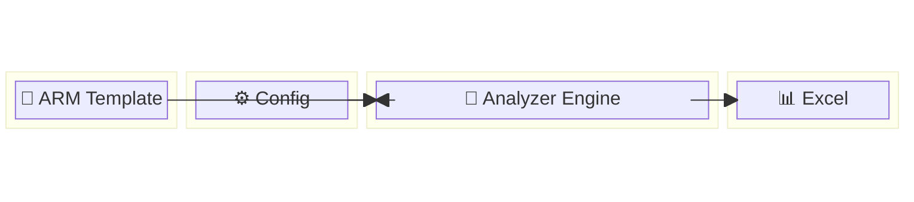

### 1.2 Complete System Flow Architecture

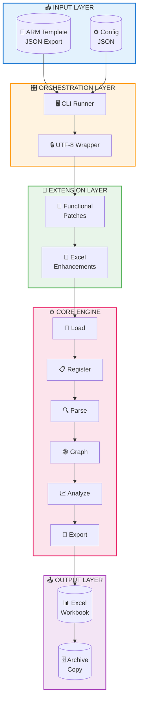

---

## 📊 SECTION 2: CORE ENGINE INTERNAL ARCHITECTURE

### 2.1 Eight-Phase Processing Pipeline

```mermaid
flowchart LR
    subgraph P1["Phase 1"]
        L["📂<br/>LOAD"]
    end
    
    subgraph P2["Phase 2"]
        R["📋<br/>REGISTER"]
    end
    
    subgraph P3["Phase 3"]
        PA["🔍<br/>PARSE"]
    end
    
    subgraph P4["Phase 4"]
        D["🔗<br/>DEPEND"]
    end
    
    subgraph P5["Phase 5"]
        G["🕸️<br/>GRAPH"]
    end
    
    subgraph P6["Phase 6"]
        T["📊<br/>TOPO"]
    end
    
    subgraph P7["Phase 7"]
        A["📈<br/>STATS"]
    end
    
    subgraph P8["Phase 8"]
        E["💾<br/>EXPORT"]
    end

    P1 --> P2 --> P3 --> P4 --> P5 --> P6 --> P7 --> P8

    style P1 fill:#BBDEFB,stroke:#1976D2,stroke-width:3px
    style P2 fill:#B3E5FC,stroke:#0288D1,stroke-width:3px
    style P3 fill:#B2EBF2,stroke:#0097A7,stroke-width:3px
    style P4 fill:#B2DFDB,stroke:#00796B,stroke-width:3px
    style P5 fill:#C8E6C9,stroke:#388E3C,stroke-width:3px
    style P6 fill:#DCEDC8,stroke:#689F38,stroke-width:3px
    style P7 fill:#FFF9C4,stroke:#FBC02D,stroke-width:3px
    style P8 fill:#FFCCBC,stroke:#E64A19,stroke-width:3px
```

### 2.2 Resource Parsing Order Hierarchy

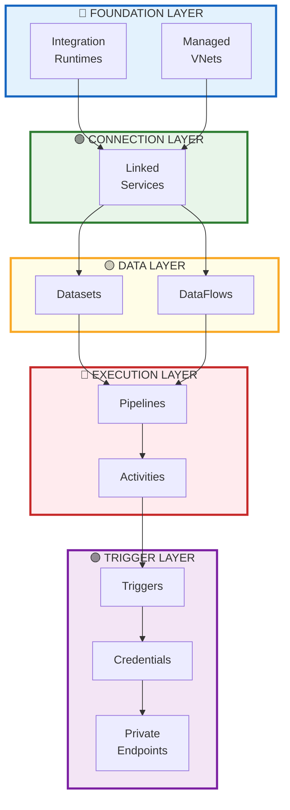

### 2.3 Data Structure State Machine

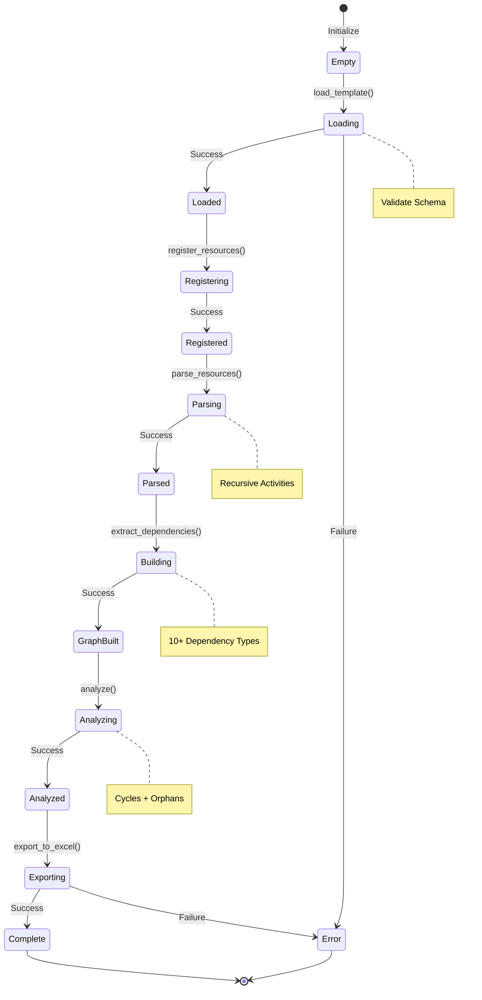

---

## 📊 SECTION 3: DEPENDENCY GRAPH ARCHITECTURE

### 3.1 Ten Dependency Types Visualization

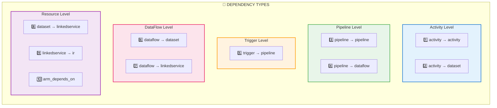

### 3.2 Full Resource Dependency Network

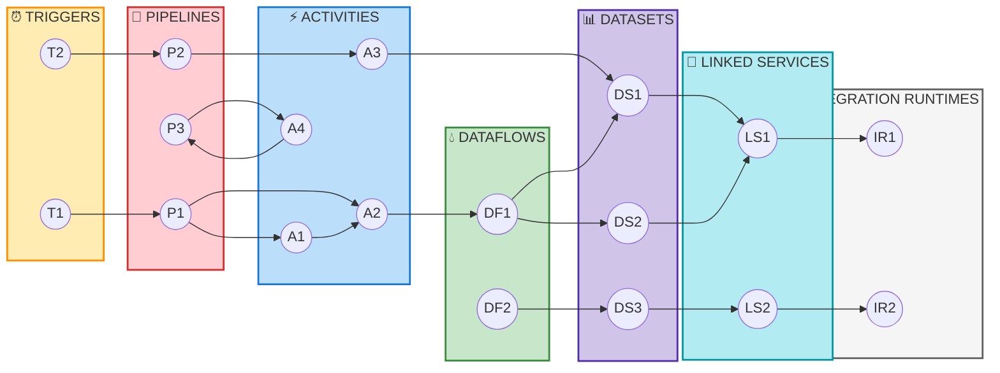

---

## 📊 SECTION 4: TOPOLOGICAL EXECUTION ORDERING

### 4.1 BFS Algorithm Flow

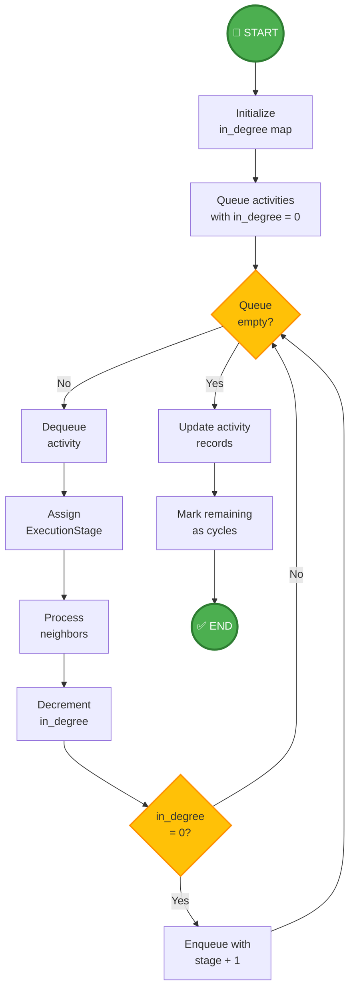

### 4.2 Execution Stage Levels Visualization

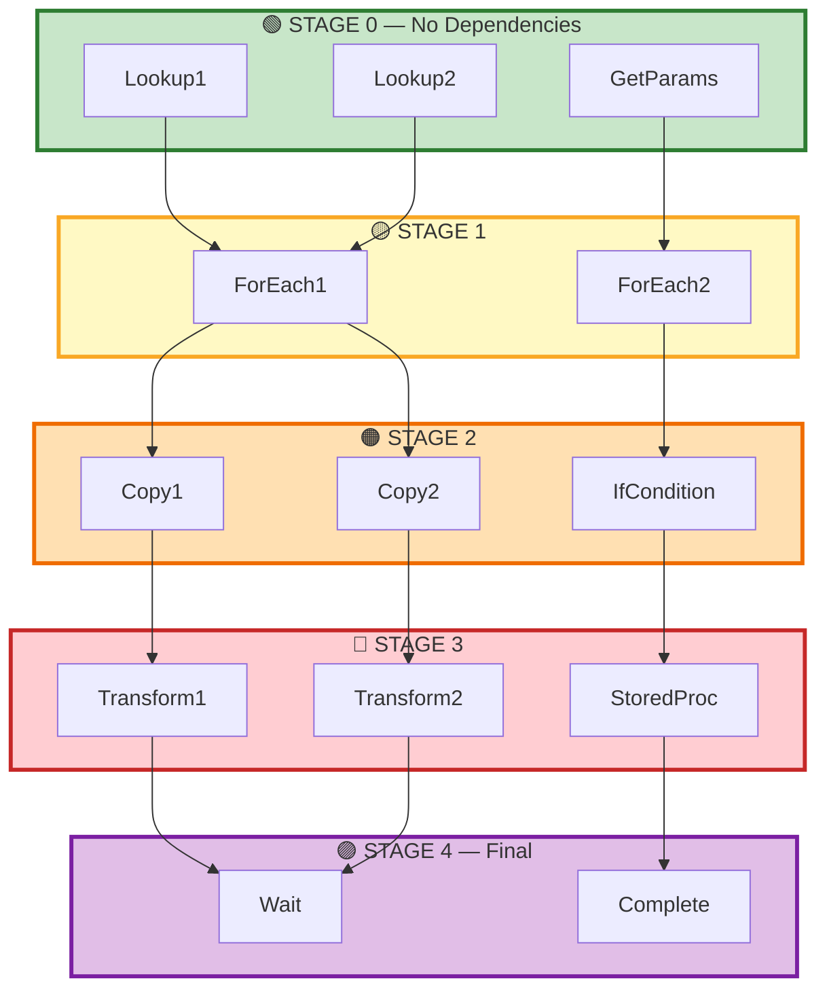

---

## 📊 SECTION 5: RECURSIVE ACTIVITY PARSING

### 5.1 Nested Container Structure

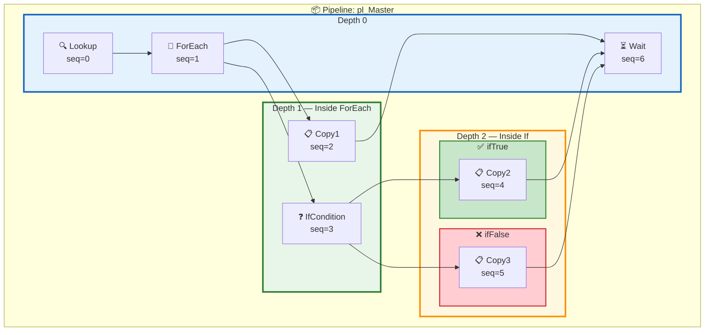

### 5.2 Container Type Dispatch

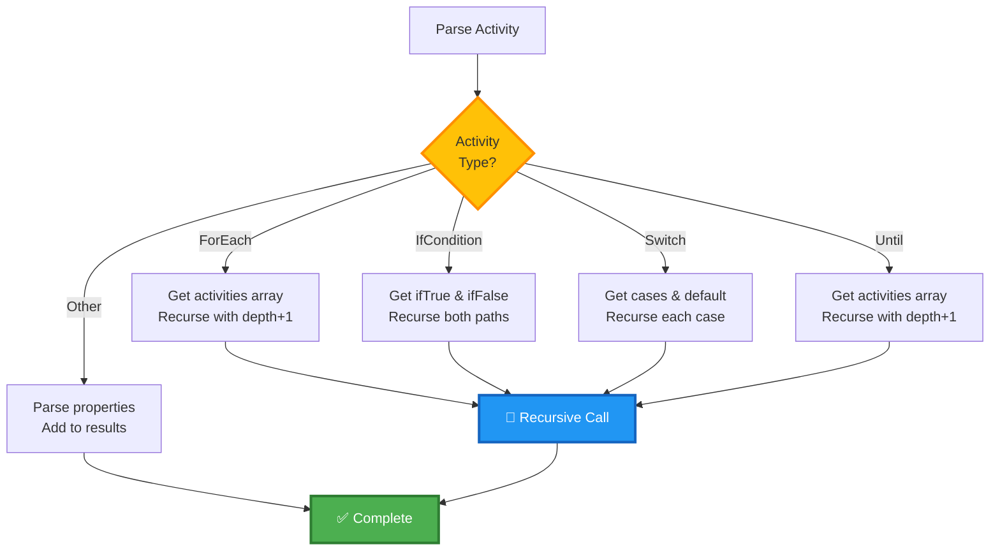

---

## 📊 SECTION 6: MONKEY PATCHING ARCHITECTURE

### 6.1 Patch Injection Sequence

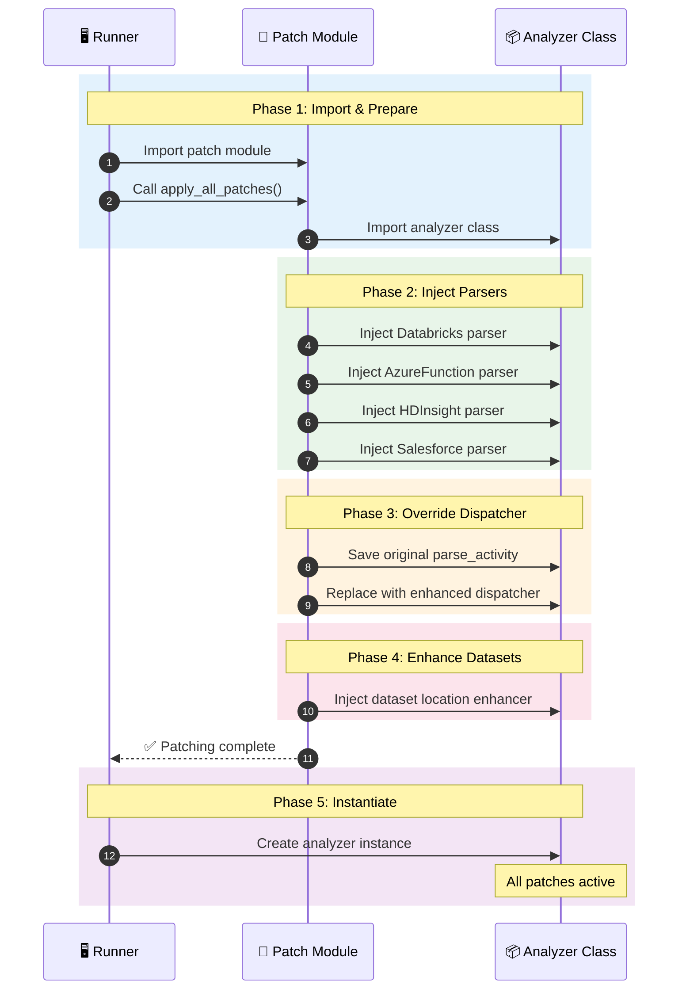

### 6.2 Before vs After Patching

```mermaid
flowchart LR
    subgraph BEFORE["🔵 BEFORE PATCHING"]
        direction TB
        B1["Base Class"]
        B2["19 Parsers"]
        B3["Original Dispatcher"]
    end

    subgraph PATCH["🟢 PATCH PROCESS"]
        direction TB
        P1["+ Databricks"]
        P2["+ AzureFunction"]
        P3["+ HDInsight"]
        P4["+ Salesforce"]
        P5["+ Dataset Enhance"]
        P6["Override Dispatcher"]
    end

    subgraph AFTER["🟣 AFTER PATCHING"]
        direction TB
        A1["Enhanced Class"]
        A2["26 Parsers"]
        A3["Enhanced Dispatcher"]
    end

    BEFORE --> PATCH
    PATCH --> AFTER

    style BEFORE fill:#BBDEFB,stroke:#1565C0,stroke-width:3px
    style PATCH fill:#C8E6C9,stroke:#2E7D32,stroke-width:3px
    style AFTER fill:#E1BEE7,stroke:#7B1FA2,stroke-width:3px
```

### 6.3 Enhanced Dispatcher Logic

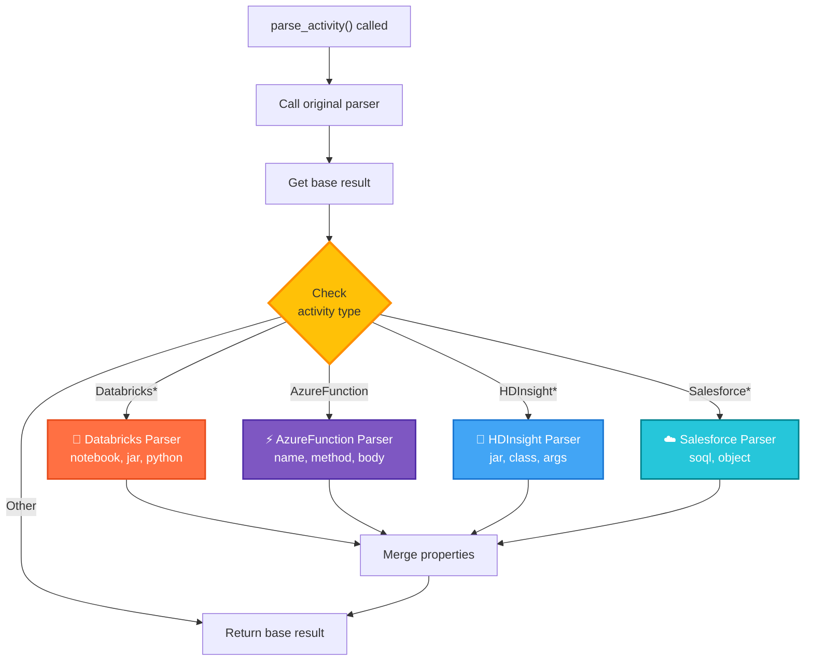

---

## 📊 SECTION 7: EXCEL EXPORT PIPELINE

### 7.1 Export Process Flow

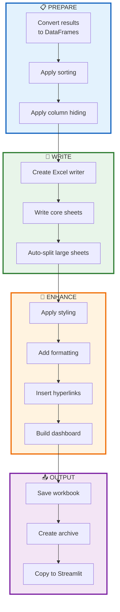

### 7.2 Auto-Split Logic for Large Sheets

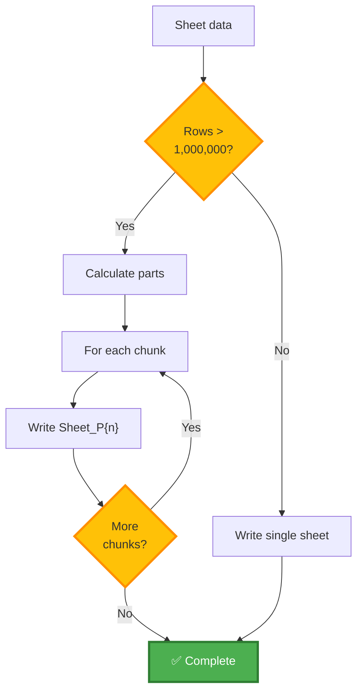

### 7.3 Excel Sheet Organization

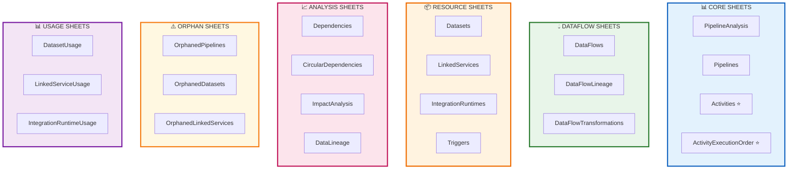

---

## 📊 SECTION 8: ENHANCEMENT LAYER ARCHITECTURE

### 8.1 Enhancement Pipeline Flow

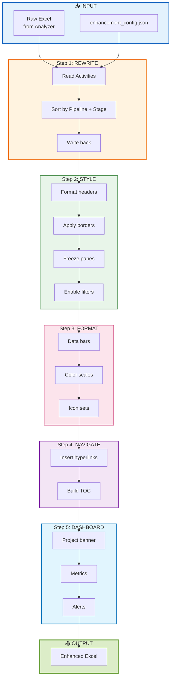

### 8.2 Enhancement Configuration Decision Tree

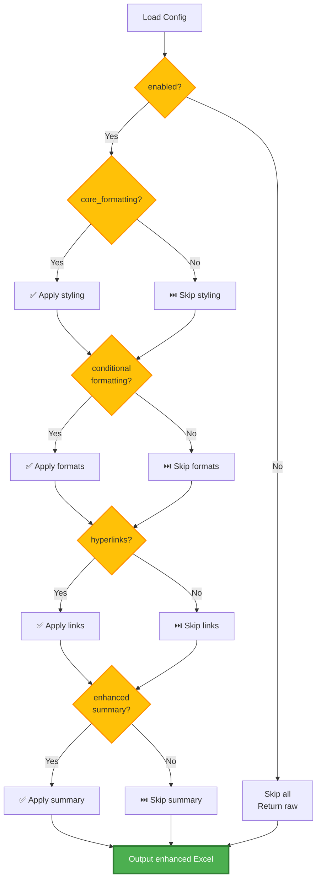

---

## 📊 SECTION 9: CLI EXECUTION MODES

### 9.1 Four Execution Mode Comparison

```mermaid
flowchart TB
    subgraph MODE1["🔵 BASIC MODE<br/>--basic"]
        direction TB
        M1A["Skip functional patches"]
        M1B["Skip Excel enhancements"]
        M1C["Base analyzer only"]
        M1D["Plain Excel output"]
    end

    subgraph MODE2["🟢 FUNCTIONAL ONLY<br/>--skip-excel-enhancements"]
        direction TB
        M2A["Apply functional patches"]
        M2B["Skip Excel enhancements"]
        M2C["Extended parsers active"]
        M2D["Plain Excel output"]
    end

    subgraph MODE3["🟡 EXCEL ONLY<br/>--skip-functional"]
        direction TB
        M3A["Skip functional patches"]
        M3B["Apply Excel enhancements"]
        M3C["Base parsers only"]
        M3D["Styled Excel output"]
    end

    subgraph MODE4["🟣 FULL PRODUCTION<br/>(default)"]
        direction TB
        M4A["Apply functional patches"]
        M4B["Apply Excel enhancements"]
        M4C["All parsers active"]
        M4D["Fully enhanced Excel"]
    end

    style MODE1 fill:#BBDEFB,stroke:#1565C0,stroke-width:3px
    style MODE2 fill:#C8E6C9,stroke:#2E7D32,stroke-width:3px
    style MODE3 fill:#FFF9C4,stroke:#F9A825,stroke-width:3px
    style MODE4 fill:#E1BEE7,stroke:#7B1FA2,stroke-width:3px
```

### 9.2 CLI Decision Flow

```mermaid
flowchart TD
    START["User runs CLI"] --> PARSE["Parse arguments"]
    PARSE --> BASIC{"--basic<br/>flag?"}
    
    BASIC -->|Yes| SKIPALL["Skip all patches<br/>Skip all enhancements"]
    BASIC -->|No| CHECKF{"--skip-functional?"}
    
    CHECKF -->|Yes| SKIPFUNC["Skip functional patches"]
    CHECKF -->|No| APPLYFUNC["Apply functional patches"]
    
    SKIPFUNC --> CHECKE{"--skip-excel?"}
    APPLYFUNC --> CHECKE
    
    CHECKE -->|Yes| SKIPEXCEL["Skip Excel enhancements"]
    CHECKE -->|No| APPLYEXCEL["Apply Excel enhancements"]
    
    SKIPALL --> RUN
    SKIPEXCEL --> RUN
    APPLYEXCEL --> RUN
    
    RUN["Run analyzer"] --> OUTPUT["Generate Excel"]

    style BASIC fill:#FFC107,stroke:#FF8F00,stroke-width:2px
    style CHECKF fill:#FFC107,stroke:#FF8F00,stroke-width:2px
    style CHECKE fill:#FFC107,stroke:#FF8F00,stroke-width:2px
    style OUTPUT fill:#4CAF50,stroke:#2E7D32,stroke-width:3px,color:#fff
```

---

## 📊 SECTION 10: DATA LINEAGE TRACEABILITY

### 10.1 End-to-End Data Lineage Chain

```mermaid
flowchart LR
    subgraph TRIGGER["⏰ TRIGGER"]
        T["Schedule<br/>Every 15 min"]
    end

    subgraph PIPELINE1["🔄 MASTER PIPELINE"]
        P1["pl_Master"]
    end

    subgraph ACTIVITIES1["⚡ ACTIVITIES"]
        A1["Lookup"]
        A2["ExecutePipeline"]
        A3["ExecuteDataFlow"]
    end

    subgraph PIPELINE2["🔄 CHILD PIPELINE"]
        P2["pl_Child"]
    end

    subgraph ACTIVITIES2["⚡ CHILD ACTIVITIES"]
        A4["Copy"]
    end

    subgraph DATAFLOW["💧 DATAFLOW"]
        DF["df_Transform"]
    end

    subgraph DATASETS["📊 DATASETS"]
        DS1["Source"]
        DS2["Staging"]
        DS3["Target"]
    end

    subgraph LINKEDSERVICES["🔗 LINKED SERVICES"]
        LS1["ls_Source"]
        LS2["ls_Target"]
    end

    subgraph RUNTIMES["🖥️ RUNTIMES"]
        IR1["Azure IR"]
        IR2["Self-hosted IR"]
    end

    T --> P1
    P1 --> A1
    P1 --> A2
    P1 --> A3
    A2 --> P2
    P2 --> A4
    A4 --> DS1
    A4 --> DS2
    A3 --> DF
    DF --> DS2
    DF --> DS3
    DS1 --> LS1
    DS2 --> LS2
    DS3 --> LS2
    LS1 --> IR1
    LS2 --> IR2

    style TRIGGER fill:#FFECB3,stroke:#FF8F00,stroke-width:3px
    style PIPELINE1 fill:#FFCDD2,stroke:#D32F2F,stroke-width:3px
    style PIPELINE2 fill:#FFCDD2,stroke:#D32F2F,stroke-width:2px
    style DATAFLOW fill:#C8E6C9,stroke:#388E3C,stroke-width:3px
    style DATASETS fill:#D1C4E9,stroke:#512DA8,stroke-width:3px
    style LINKEDSERVICES fill:#B2EBF2,stroke:#0097A7,stroke-width:3px
    style RUNTIMES fill:#F5F5F5,stroke:#616161,stroke-width:3px
```

---

## 📊 SECTION 11: CYCLE DETECTION ALGORITHM

### 11.1 Tarjan's SCC Algorithm Flow

```mermaid
flowchart TD
    START(("🚀 START")) --> INIT["Initialize<br/>index, lowlink, stack"]
    INIT --> FORALL["For each node"]
    FORALL --> VISITED{"Node<br/>visited?"}
    
    VISITED -->|No| STRONG["strongconnect(node)"]
    VISITED -->|Yes| NEXT["Next node"]
    NEXT --> DONE{"All nodes<br/>processed?"}
    
    DONE -->|No| FORALL
    DONE -->|Yes| RESULT["Return SCC list"]
    
    STRONG --> SETINDEX["Set index, lowlink"]
    SETINDEX --> PUSH["Push to stack"]
    PUSH --> NEIGHBORS["For each neighbor"]
    NEIGHBORS --> NVISITED{"Neighbor<br/>visited?"}
    
    NVISITED -->|No| RECURSE["Recurse neighbor"]
    NVISITED -->|Yes, on stack| UPDATE["Update lowlink"]
    
    RECURSE --> UPDATEMIN["lowlink = min(...)"]
    UPDATE --> UPDATEMIN
    UPDATEMIN --> MOREN{"More<br/>neighbors?"}
    
    MOREN -->|Yes| NEIGHBORS
    MOREN -->|No| ISROOT{"Is root?<br/>lowlink = index"}
    
    ISROOT -->|Yes| POP["Pop SCC<br/>from stack"]
    ISROOT -->|No| RETURN["Return"]
    
    POP --> RECORD["Record cycle<br/>if size > 1"]
    RECORD --> RETURN
    RETURN --> FORALL

    RESULT --> FINISH(("✅ END"))

    style START fill:#4CAF50,stroke:#2E7D32,stroke-width:3px,color:#fff
    style FINISH fill:#4CAF50,stroke:#2E7D32,stroke-width:3px,color:#fff
    style VISITED fill:#FFC107,stroke:#FF8F00,stroke-width:2px
    style NVISITED fill:#FFC107,stroke:#FF8F00,stroke-width:2px
    style DONE fill:#FFC107,stroke:#FF8F00,stroke-width:2px
    style MOREN fill:#FFC107,stroke:#FF8F00,stroke-width:2px
    style ISROOT fill:#FFC107,stroke:#FF8F00,stroke-width:2px
```

---

## 📊 SECTION 12: COMPLETE SYSTEM SUMMARY

### 12.1 System Architecture Overview

```mermaid
flowchart TB
    subgraph USER["👤 USER"]
        CLI["python patched_runner.py<br/>template.json"]
    end

    subgraph ORCHESTRATOR["🎛️ ORCHESTRATOR"]
        RUNNER["Patched Runner"]
        ARGS["Parse Args"]
    end

    subgraph EXTENSIONS["🔌 EXTENSIONS"]
        FP["Functional Patches<br/>+7 parsers"]
        EP["Excel Enhancements<br/>styling + dashboards"]
    end

    subgraph ENGINE["⚙️ CORE ENGINE"]
        PHASE["8 Processing Phases"]
    end

    subgraph OUTPUTS["📤 OUTPUTS"]
        EXCEL["📊 Excel Workbook"]
        ARCHIVE["🗄️ Archive Copy"]
        STCOPY["📁 Streamlit Copy"]
    end

    subgraph CONSUMERS["👥 CONSUMERS"]
        MANUAL["Manual Review"]
        VALID["Validation Scripts"]
        STREAM["Streamlit Dashboard<br/>(out of scope)"]
    end

    CLI --> RUNNER
    RUNNER --> ARGS
    ARGS --> FP
    ARGS --> EP
    FP --> PHASE
    EP --> PHASE
    PHASE --> EXCEL
    EXCEL --> ARCHIVE
    EXCEL --> STCOPY
    EXCEL --> MANUAL
    EXCEL --> VALID
    STCOPY -.-> STREAM

    style USER fill:#E3F2FD,stroke:#1565C0,stroke-width:3px
    style ORCHESTRATOR fill:#FFF3E0,stroke:#EF6C00,stroke-width:3px
    style EXTENSIONS fill:#E8F5E9,stroke:#2E7D32,stroke-width:3px
    style ENGINE fill:#FCE4EC,stroke:#C2185B,stroke-width:3px
    style OUTPUTS fill:#F3E5F5,stroke:#7B1FA2,stroke-width:3px
    style CONSUMERS fill:#E1F5FE,stroke:#0277BD,stroke-width:3px
```

### 12.2 File Responsibility Summary

```mermaid
flowchart LR
    subgraph FILES["📁 CORE FILES"]
        F1["adf_analyzer_v10_complete.py<br/>⚙️ Core Engine"]
        F2["adf_analyzer_v10_patch.py<br/>🧩 Extensions"]
        F3["adf_analyzer_v10_patched_runner.py<br/>🎛️ Orchestrator"]
        F4["adf_analyzer_v10_excel_enhancements.py<br/>🎨 Beautification"]
    end

    subgraph ROLES["🎯 ROLES"]
        R1["ARM parsing<br/>Dependency graphs<br/>Topological sort<br/>Excel export"]
        R2["Activity parsers<br/>Dataset parsers<br/>Dispatcher override"]
        R3["CLI handling<br/>Patch control<br/>Execution flow"]
        R4["Styling<br/>Formatting<br/>Dashboards"]
    end

    F1 --> R1
    F2 --> R2
    F3 --> R3
    F4 --> R4

    style F1 fill:#FCE4EC,stroke:#C2185B,stroke-width:3px
    style F2 fill:#E8F5E9,stroke:#2E7D32,stroke-width:3px
    style F3 fill:#FFF3E0,stroke:#EF6C00,stroke-width:3px
    style F4 fill:#E3F2FD,stroke:#1565C0,stroke-width:3px
```

---

## 📋 DIAGRAM TYPE REFERENCE

| Section | Diagram Type | Purpose |
|---------|--------------|---------|
| 1.1 | Block Diagram | High-level system view |
| 1.2 | Layered Flowchart | Component architecture |
| 2.1 | Horizontal Pipeline | Phase progression |
| 2.2 | Vertical Hierarchy | Resource dependencies |
| 2.3 | State Diagram | Processing states |
| 3.1-3.2 | Network Graph | Dependency visualization |
| 4.1 | Algorithm Flowchart | BFS logic |
| 4.2 | Staged Flowchart | Execution levels |
| 5.1-5.2 | Nested Flowchart | Recursive structure |
| 6.1 | Sequence Diagram | Runtime interaction |
| 6.2-6.3 | Transformation Flowchart | Patch mechanism |
| 7.1-7.3 | Pipeline Flowchart | Export process |
| 8.1-8.2 | Decision Tree | Configuration logic |
| 9.1-9.2 | Comparison Flowchart | Mode differences |
| 10.1 | Lineage Graph | Data traceability |
| 11.1 | Algorithm Flowchart | Tarjan's SCC |
| 12.1-12.2 | Summary Flowchart | System overview |

---

**Document Version:** 3.0 Advanced Edition  
**Diagram Syntax:** Validated Mermaid 10.x  
**Last Updated:** January 19, 2026

**The generated Excel workbook is later consumed by a Streamlit-based visualization layer, which is under active development and intentionally out of scope for this document.**
