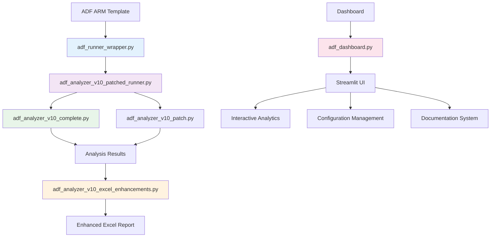

# 🚀 ADF Analyzer v10.1 - Ultimate Interactive Edition

[](https://github.com/AvinashAnalytics/Azure-Data-Factory-Analyzer-Ultimate-Interactive-Edition)
[](https://www.python.org/)
[](LICENSE)
[](https://streamlit.io/)
[](https://azure.microsoft.com/en-us/services/data-factory/)

**Enterprise-grade toolkit for Azure Data Factory ARM template analysis with interactive dashboard and comprehensive Excel reporting.**

---

## 📑 **TABLE OF CONTENTS**

- [🎯 Overview](#-overview)
- [⚡ Quick Start](#-quick-start)  
- [🏗️ Architecture](#️-architecture)
- [💡 Key Features](#-key-features)
- [📊 Dashboard Features](#-dashboard-features)
- [📋 File Structure](#-file-structure)
- [🔧 Installation & Setup](#-installation--setup)
- [🎮 Usage Guide](#-usage-guide)
- [📈 Output Examples](#-output-examples)
- [🛠️ Development](#️-development)
- [📚 Documentation](#-documentation)

---

## 🎯 **OVERVIEW**

ADF Analyzer v10.1 is an **enterprise-grade toolkit** designed to parse, analyze, and visualize Azure Data Factory (ADF) ARM templates with unprecedented speed and detail. This version introduces a modernized Streamlit dashboard with dual-mode operation, comprehensive documentation system, and professional Excel reporting capabilities.

### **What's New in v10.1**

- 🎛️ **Dual-Mode Dashboard**: Choose between "Generate Excel" and "Upload & Analyze" workflows
- 🔧 **Wrapper System**: Production-ready `adf_runner_wrapper.py` with Unicode handling and auto-discovery
- 📊 **Enhanced Documentation**: Complete in-app documentation with 5 comprehensive sections
- 🎨 **Modern UI**: Streamlined interface with enhancement configuration management
- 📈 **Advanced Analytics**: Dependency tracking, lineage analysis, and impact assessment
- 🔍 **Comprehensive Validation**: Built-in verification system with detailed reports

### **Supported Resources**

| Category | Count | Examples |
|----------|-------|----------|
| **Activities** | 44+ | Copy, DataFlow, Lookup, Execute Pipeline, Databricks, Azure Function |
| **Datasets** | 25+ | SQL Server, Blob Storage, CosmosDB, BigQuery, Office365 |
| **Linked Services** | 15+ | Azure SQL, Storage Account, Key Vault, Databricks |
| **Triggers** | 7+ | Schedule, Tumbling Window, Event-based, Manual |
| **Others** | 20+ | Integration Runtimes, Managed VNets, Private Endpoints |

---

## ⚡ **QUICK START**

### **5-Minute Setup**

```bash
# 1. Clone or download the repository
git clone https://github.com/AvinashAnalytics/Azure-Data-Factory-Analyzer-Ultimate-Interactive-Edition.git
cd Azure-Data-Factory-Analyzer-Ultimate-Interactive-Edition/armv10

# 2. Install dependencies
pip install streamlit pandas openpyxl plotly networkx

# 3. Quick analysis (recommended entry point)
python adf_runner_wrapper.py your_template.json

# 4. Launch interactive dashboard
streamlit run adf_dashboard.py
```

### **Entry Points**

| Method | Use Case | Command |
|--------|----------|---------|
| **🚀 Wrapper (Recommended)** | Production analysis | `python adf_runner_wrapper.py template.json` |
| **🎛️ Dashboard** | Interactive analysis | `streamlit run adf_dashboard.py` |
| **🔧 Patched Runner** | Enhanced analysis | `python adf_analyzer_v10_patched_runner.py template.json` |
| **⚙️ Direct Engine** | Core analysis only | `python adf_analyzer_v10_complete.py template.json` |

---

## 🏗️ **ARCHITECTURE**



### **Component Relationships**

- **🔧 Wrapper Layer**: `adf_runner_wrapper.py` - Safe execution with Unicode handling
- **🚀 Orchestrator**: `adf_analyzer_v10_patched_runner.py` - Business logic coordination
- **🎯 Core Engine**: `adf_analyzer_v10_complete.py` - ARM template parsing
- **🎨 Enhancement**: `adf_analyzer_v10_excel_enhancements.py` - Professional Excel output
- **📊 Dashboard**: `adf_dashboard.py` - Interactive Streamlit interface

---

## 💡 **KEY FEATURES**

### **🔍 Analysis Capabilities**

<table>
<tr>
<td width="50%">

**📊 Comprehensive Parsing**
- All ADF resource types supported
- Activity detection and classification
- Dataset and linked service analysis
- Trigger processing and validation
- Integration runtime assessment

**🔗 Dependency Analysis**
- Complete dependency graph construction
- Circular dependency detection (DFS algorithm)
- Orphaned resource identification
- Impact analysis (BFS traversal)
- Lineage tracking and visualization

</td>
<td width="50%">

**🏥 Health Assessment**
- Factory health score (0-100 scale)
- Quality score with deduction system
- Resource utilization metrics
- Performance bottleneck identification
- Security checklist validation

**📈 Advanced Metrics**
- Resource distribution analysis
- Complexity heat mapping
- Performance insights
- Cost optimization recommendations
- Best practices compliance

</td>
</tr>
</table>

### **📊 Excel Reporting Features**

- ✅ **Core Formatting** - Professional styling, borders, colors
- ✅ **Conditional Formatting** - Data bars, color scales, icon sets
- ✅ **Hyperlinks** - Navigation between sheets
- ✅ **Enhanced Summary** - Executive dashboard with project banner
- ✅ **Advanced Dashboard** - Health score, complexity maps, insights
- ✅ **Performance Analysis** - Bottleneck identification and recommendations
- ✅ **Security Assessment** - Comprehensive security checklist
- ✅ **Cost Analysis** - Resource utilization and optimization

---

## 📊 **DASHBOARD FEATURES**

### **🎛️ Dual-Mode Operation**

#### **Mode 1: Generate Excel**
- Upload ARM template
- Configure enhancement options
- Generate professional Excel report
- Download enhanced results

#### **Mode 2: Upload & Analyze**  
- Upload existing Excel analysis
- Interactive data exploration
- Real-time analytics and visualizations
- Export filtered results

### **📚 Documentation System**

The dashboard includes a comprehensive documentation system with 5 main sections:

| Tab | Content | Purpose |
|-----|---------|---------|
| **📋 Dashboard Tiles** | Metric definitions and data sources | Understanding dashboard metrics |
| **🧠 Technical Logic** | Algorithms and scoring methods | Technical reference |
| **🐍 Python Files** | Complete file structure overview | Developer guide |
| **📖 Complete Guide** | Project documentation and setup | User manual |
| **⚙️ Configuration** | Settings and customization | Configuration guide |

### **🎨 Interactive Analytics**

- **📊 Health Gauge** - Visual factory health indicator
- **🕸️ Network Graphs** - Interactive dependency visualization
- **📈 Metric Tiles** - Real-time analytics with verification badges
- **🔍 Filtering** - Advanced filtering and search capabilities
- **📥 Export Options** - CSV, JSON, Excel export functionality

---

## 📋 **FILE STRUCTURE**

```
armv10/
├── 🚀 Core Analysis Engine
│   ├── adf_analyzer_v10_complete.py           # Main analysis engine
│   ├── adf_analyzer_v10_patched_runner.py     # Orchestrator with patches
│   └── adf_runner_wrapper.py                  # Safe execution wrapper (RECOMMENDED)
├── 🎨 Enhancements & Processing  
│   ├── adf_analyzer_v10_excel_enhancements.py # Excel beautification
│   └── adf_analyzer_v10_patch.py              # Functional patches
├── 📊 Dashboard & UI
│   ├── adf_dashboard.py                       # Main Streamlit dashboard
│   └── streamlit_app/                         # Application structure
├── 🔧 Configuration & Settings
│   ├── enhancement_config.json                # Excel enhancement settings
│   ├── streamlit_config.json                  # Dashboard configuration
│   └── settings.json                          # General settings
├── 🔧 Utilities & Scripts
│   ├── scripts/setup_environment.py           # Environment setup
│   ├── scripts/run_analysis.py               # Direct execution
│   └── scripts/verify_installation.py        # Validation
├── ✅ Testing & Validation
│   ├── test_metrics.py                       # Metrics testing
│   ├── test_metrics_enhanced.py              # Enhanced testing
│   ├── verify_real_world.py                  # Real-world testing
│   └── TEST_RESULTS.py                       # Test results summary
└── 📚 Documentation
    ├── TILES.md                              # Dashboard tiles reference
    ├── LOGIC.md                              # Technical algorithms
    ├── PYTHON_FILES_REFERENCE.md             # Complete file guide
    ├── DOCUMENTATION_INDEX.md                # Master documentation index
    └── README_v10.md                         # This file
```

---

## 🔧 **INSTALLATION & SETUP**

### **Prerequisites**

- **Python 3.8+** (Recommended: 3.9 or 3.10)
- **Windows/Linux/macOS** (Cross-platform support)
- **4GB RAM minimum** (8GB recommended for large templates)

### **Method 1: Direct Installation**

```bash
# Install core dependencies
pip install streamlit pandas openpyxl plotly networkx

# Optional: Install additional packages for enhanced features
pip install matplotlib seaborn xlsxwriter

# Verify installation
python scripts/verify_installation.py
```

### **Method 2: Virtual Environment (Recommended)**

```bash
# Create virtual environment
python -m venv adf_analyzer_env

# Activate environment
# Windows:
adf_analyzer_env\Scripts\activate
# Linux/macOS:
source adf_analyzer_env/bin/activate

# Install dependencies
pip install -r requirements.txt
```

### **Method 3: Using Setup Script**

```bash
# Run automated setup
python scripts/setup_environment.py

# Follow interactive prompts for:
# - Dependency installation
# - Configuration setup
# - Environment validation
```

---

## 🎮 **USAGE GUIDE**

### **Command Line Usage**

#### **🚀 Production Analysis (Recommended)**
```bash
# Basic analysis
python adf_runner_wrapper.py your_template.json

# With custom output directory
python adf_runner_wrapper.py your_template.json --output ./reports

# Enhanced analysis with all features
python adf_analyzer_v10_patched_runner.py your_template.json --enhanced
```

#### **📊 Dashboard Mode**
```bash
# Launch interactive dashboard
streamlit run adf_dashboard.py

# Custom port and configuration
streamlit run adf_dashboard.py --server.port 8502 --server.headless true
```

### **Dashboard Workflows**

#### **Workflow 1: Generate Excel Report**

1. **📤 Upload Template**
   - Select ARM template file (.json)
   - Validate template structure
   - Preview template summary

2. **⚙️ Configure Enhancements**
   - Toggle Excel enhancement features
   - Customize dashboard options
   - Set performance parameters

3. **🔄 Generate Analysis**
   - Click "Generate Enhanced Excel"
   - Monitor real-time progress
   - Review analysis summary

4. **📥 Download Results**
   - Download enhanced Excel report
   - Export additional formats (CSV, JSON)
   - Save configuration for reuse

#### **Workflow 2: Upload & Analyze**

1. **📤 Upload Analysis**
   - Select existing Excel analysis
   - Validate data structure
   - Load into dashboard

2. **🔍 Explore Data**
   - Use interactive analytics
   - Filter and search resources
   - Generate custom visualizations

3. **📊 Generate Insights**
   - View health assessments
   - Analyze dependency graphs
   - Identify optimization opportunities

4. **📥 Export Results**
   - Download filtered data
   - Export visualizations
   - Generate summary reports

### **Configuration Management**

#### Excel Enhancements Settings (Dashboard)

- Location in UI: Sidebar → "⚙️ Excel Enhancements settings"
- Persistence: Saved to `core/enhancement_config.json` and applied immediately at runtime
- Master toggle: If disabled, the app bypasses all beautification and calls the original export (no auto-linking)
- Granular toggles: Each phase (core formatting, conditional formatting, hyperlinks, protection, page setup) can be enabled/disabled individually
- Sheet protection: Optional password; leave blank for no password (Summary sheet remains unprotected by design)
- Reset: Click "Reset to defaults" to restore the built-in default configuration

#### Enhancement Configuration (on disk)
```json
{
  "excel_enhancements": {
    "enabled": true,
    "core_formatting": {
      "enabled": true,
      "column_sizing": true,
      "number_format": true,
      "alignment": true,
      "borders": true,
      "row_shading": true,
      "header_style": true
    },
    "conditional_formatting": {
      "enabled": true,
      "data_bars": true,
      "icon_sets": true,
      "color_scales": true,
      "status_highlighting": true
    },
    "hyperlinks": {
      "enabled": true,
      "summary_navigation": true,
      "auto_convert_references": true
    },
    "protection": {
      "enabled": false,
      "password": null
    },
    "enhanced_summary": {
      "enabled": true,
      "project_banner": true,
      "executive_summary": true,
      "critical_alerts": true,
      "metrics_dashboard": true,
      "resource_overview": true,
      "recommendations": true
    },
    "advanced_dashboard": {
      "enabled": true,
      "health_score": true,
      "cost_analysis": false,
      "complexity_heat_map": true,
      "performance_insights": true,
      "top_pipelines": true,
      "security_checklist": true,
      "activity_distribution": true,
      "network_stats": true,
      "change_risk": true
    },
    "page_setup": {
      "enabled": true,
      "orientation": "landscape"
    }
  }
}
```

#### **Dashboard Configuration**
```json
{
  "ui": {
    "theme": "default",
    "sidebar_state": "expanded"
  },
  "performance": {
    "cache_enabled": true,
    "max_file_size": "200MB"
  },
  "features": {
    "network_graphs": true,
    "advanced_charts": true
  }
}
```

---

## 📈 **OUTPUT EXAMPLES**

### **Excel Report Structure**

| Sheet | Content | Purpose |
|-------|---------|---------|
| **📊 Summary** | Executive dashboard with key metrics | High-level overview |
| **🏭 Factory** | Complete factory resource inventory | Detailed resource listing |
| **📈 Activities** | Activity analysis with types and usage | Activity insights |
| **📦 Datasets** | Dataset categorization and lineage | Data source analysis |
| **🔗 LinkedServices** | Connection analysis and validation | Infrastructure review |
| **⏰ Triggers** | Trigger configuration and scheduling | Automation analysis |
| **🕸️ Dependencies** | Complete dependency mapping | Impact analysis |
| **🔄 DataLineage** | End-to-end data flow tracking | Lineage visualization |
| **⚠️ Issues** | Problems and recommendations | Quality assessment |

### **Health Score Calculation**

```python
# Health Score Formula
if pipelines > 0:
    health_score = int((1 - orphaned / pipelines) * 100)
else:
    health_score = 100

# Status Thresholds
# 90-100: Excellent (🟢)
# 75-89:  Good (🔵)  
# 60-74:  Fair (🟡)
# <60:    Needs Attention (🔴)
```

### **Quality Score Deductions**

Starting from 100, deductions applied for:
- **Circular Dependencies**: -10 points per cycle (max -30)
- **Orphaned Resources**: Based on percentage (max -20)
- **Broken Triggers**: -5 points per broken trigger (max -15)

---

## 🛠️ **DEVELOPMENT**

### **Extending the Analyzer**

#### **Adding New Activity Types**

1. **Update Core Parser** (`adf_analyzer_v10_complete.py`)
```python
def handle_new_activity_type(self, activity):
    """Handle new custom activity type"""
    return {
        'type': 'CustomActivity',
        'properties': activity.get('typeProperties', {}),
        'dependencies': self.extract_dependencies(activity)
    }
```

2. **Add Patch Support** (`adf_analyzer_v10_patch.py`)
```python
def patch_new_activity_handling(self, analyzer):
    """Patch for new activity type support"""
    original_method = analyzer.parse_activity
    
    def enhanced_parse_activity(activity):
        if activity.get('type') == 'CustomActivity':
            return self.handle_new_activity_type(activity)
        return original_method(activity)
    
    analyzer.parse_activity = enhanced_parse_activity
```

3. **Update Enhancement Layer** (`adf_analyzer_v10_excel_enhancements.py`)
```python
def format_custom_activity_sheet(self, workbook, worksheet):
    """Format custom activity analysis"""
    # Add custom formatting logic
    pass
```

### **Contributing Guidelines**

1. **Fork the repository** and create a feature branch
2. **Follow code style** conventions (PEP 8 for Python)
3. **Add comprehensive tests** for new functionality
4. **Update documentation** for any new features
5. **Submit a pull request** with detailed description

### **Testing Framework**

```bash
# Run comprehensive tests
python test_metrics.py

# Run enhanced testing suite
python test_metrics_enhanced.py

# Real-world template testing
python verify_real_world.py

# Performance benchmarking
python test_new_metrics.py
```

---

## 📚 **DOCUMENTATION**

### **Complete Documentation Suite**

The project includes comprehensive documentation accessible both as files and within the dashboard:

#### **📋 Dashboard Tiles Reference (`TILES.md`)**
- Complete metric definitions
- Data source explanations
- Calculation methodologies
- Troubleshooting guides

#### **🧠 Technical Logic (`LOGIC.md`)**
- Algorithm descriptions
- Scoring methodologies
- Detection logic explanations
- Mathematical formulas

#### **🐍 Python Files Reference (`PYTHON_FILES_REFERENCE.md`)**
- Complete file structure
- Purpose and functionality
- Usage examples
- Integration points

#### **📚 Documentation Index (`DOCUMENTATION_INDEX.md`)**
- Master navigation guide
- Quick reference links
- Getting started guides
- Best practices

### **Accessing Documentation**

#### **In-Dashboard Access**
```
Dashboard → 📚 Documentation Tab → Choose Section
├── 📋 Dashboard Tiles
├── 🧠 Technical Logic  
├── 🐍 Python Files
├── 📖 Complete Guide
└── ⚙️ Configuration
```

#### **File System Access**
```bash
# View documentation files
ls docs/
cat TILES.md
cat LOGIC.md
cat PYTHON_FILES_REFERENCE.md
```

---

## 🔧 **TROUBLESHOOTING**

### **Common Issues & Solutions**

#### **🚨 Template Parsing Errors**

**Problem**: "Failed to parse ARM template"
```bash
# Solution 1: Validate JSON structure
python -m json.tool your_template.json

# Solution 2: Check file encoding
file your_template.json

# Solution 3: Use wrapper for better error handling
python adf_runner_wrapper.py your_template.json
```

#### **🚨 Memory Issues with Large Templates**

**Problem**: "MemoryError" or slow processing
```python
# Solution: Use chunked processing
# In enhancement_config.json:
{
  "advanced_dashboard": {
    "cost_analysis": false,  // Disable memory-intensive features
    "complexity_heat_map": false
  }
}
```

#### **🚨 Dashboard Connection Issues**

**Problem**: Dashboard won't start
```bash
# Solution 1: Check port availability
netstat -an | find "8501"

# Solution 2: Use different port
streamlit run adf_dashboard.py --server.port 8502

# Solution 3: Clear Streamlit cache
streamlit cache clear
```

#### **🚨 Excel Generation Failures**

**Problem**: "Excel file corrupted" or generation fails
```bash
# Solution 1: Use patched runner
python adf_analyzer_v10_patched_runner.py template.json

# Solution 2: Disable problematic enhancements
# Edit enhancement_config.json to disable specific features

# Solution 3: Check output directory permissions
ls -la output/
```

### **Getting Help**

- **📖 Documentation**: Check in-dashboard documentation system
- **🐛 Issues**: Report bugs on GitHub repository
- **💬 Discussions**: Use GitHub Discussions for questions
- **📧 Support**: Contact maintainers for enterprise support

---

## 📄 **LICENSE**

This project is licensed under the MIT License - see the [LICENSE](LICENSE) file for details.

---

## 🙏 **ACKNOWLEDGMENTS**

- **Azure Data Factory Team** - For comprehensive ARM template specifications
- **Streamlit Community** - For the excellent web app framework
- **Open Source Contributors** - For various libraries and tools used

---

**🚀 Ready to analyze your Azure Data Factory with unprecedented detail and professional reporting!**

---

*Last Updated: November 11, 2025 - v10.1*