# **SHOWCASE NOTICE — Documentation-Only Repository**

This repository is provided as a professional documentation and demonstration showcase for the ADF Analyzer project. The full implementation source code is private and proprietary and is not published here. The public repository intentionally contains documentation, architecture diagrams, output artifacts, and usage demonstrations only.

If you would like to discuss the source code or arrange a walkthrough, please use the contact placeholders below.

- Email: [your-email@example.com]
- LinkedIn: [Your LinkedIn Profile]

# 🚀 ADF Analyzer v10.1 - Ultimate Interactive Edition
# 🚀 ADF Analyzer v10.1 - Ultimate Interactive Edition
# 🚀 ADF Analyzer v10.1 - Ultimate Interactive Edition

[](https://github.com/AvinashAnalytics/Azure-Data-Factory-Analyzer-Ultimate-Interactive-Edition)
[](https://www.python.org/)
[](LICENSE)
[](https://streamlit.io/)
[](https://azure.microsoft.com/en-us/services/data-factory/)

**Enterprise-grade toolkit for Azure Data Factory ARM template analysis with interactive dashboard and comprehensive Excel reporting.**

---

## 📄 **TABLE OF CONTENTS**

- [🎯 Overview](#-overview)
- [⚡ Quick Start](#-quick-start)  
- [🏗️ Architecture](#️-architecture)
- [💡 Key Features](#-key-features)
- [📊 Dashboard Features](#-dashboard-features)
- [📋 File Structure](#-file-structure)
- [🔧 Installation & Setup](#-installation--setup)
- [🎮 Usage Guide](#-usage-guide)
- [📈 Output Examples](#-output-examples)
- [🛠️ Development](#️-development)
- [📚 Documentation](#-documentation)

---

## 🎯 **OVERVIEW**

ADF Analyzer v10.1 is an **enterprise-grade toolkit** designed to parse, analyze, and visualize Azure Data Factory (ADF) ARM templates with unprecedented speed and detail. This version introduces a modernized Streamlit dashboard with dual-mode operation, comprehensive documentation system, and professional Excel reporting capabilities.

### **What's New in v10.1**

- 🎛️ **Dual-Mode Dashboard**: Choose between "Generate Excel" and "Upload & Analyze" workflows
- 🔧 **Wrapper System**: Production-ready `adf_runner_wrapper.py` with Unicode handling and auto-discovery
- 📊 **Enhanced Documentation**: Complete in-app documentation with 5 comprehensive sections
- 🎨 **Modern UI**: Streamlined interface with enhancement configuration management
- 📈 **Advanced Analytics**: Dependency tracking, lineage analysis, and impact assessment
- 🔍 **Comprehensive Validation**: Built-in verification system with detailed reports

### **Supported Resources**

| Category | Count | Examples |
|----------|-------|----------|
| **Activities** | 44+ | Copy, DataFlow, Lookup, Execute Pipeline, Databricks, Azure Function |
| **Datasets** | 25+ | SQL Server, Blob Storage, CosmosDB, BigQuery, Office365 |
| **Linked Services** | 15+ | Azure SQL, Storage Account, Key Vault, Databricks |
| **Triggers** | 7+ | Schedule, Tumbling Window, Event-based, Manual |
| **Others** | 20+ | Integration Runtimes, Managed VNets, Private Endpoints |

---

## ⚡ **QUICK START**

### **5-Minute Setup**

```bash
# 1. Clone or download the repository
git clone https://github.com/AvinashAnalytics/Azure-Data-Factory-Analyzer-Ultimate-Interactive-Edition.git
cd Azure-Data-Factory-Analyzer-Ultimate-Interactive-Edition/armv10

# 2. Install dependencies
pip install streamlit pandas openpyxl plotly networkx

# 3. Quick analysis (recommended entry point)
python adf_runner_wrapper.py your_template.json

# 4. Launch interactive dashboard
streamlit run adf_dashboard.py
```

### **Entry Points**

| Method | Use Case | Command |
|--------|----------|---------|
| **🚀 Wrapper (Recommended)** | Production analysis | `python adf_runner_wrapper.py template.json` |
| **🎛️ Dashboard** | Interactive analysis | `streamlit run adf_dashboard.py` |
| **🔧 Patched Runner** | Enhanced analysis | `python adf_analyzer_v10_patched_runner.py template.json` |
| **⚙️ Direct Engine** | Core analysis only | `python adf_analyzer_v10_complete.py template.json` |

---

## 🏗️ **ARCHITECTURE**

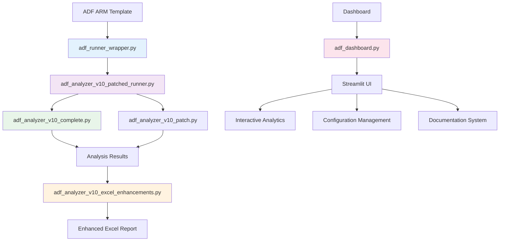

### **Component Relationships**

- **🔧 Wrapper Layer**: `adf_runner_wrapper.py` - Safe execution with Unicode handling
- **🚀 Orchestrator**: `adf_analyzer_v10_patched_runner.py` - Business logic coordination
- **🎯 Core Engine**: `adf_analyzer_v10_complete.py` - ARM template parsing
- **🎨 Enhancement**: `adf_analyzer_v10_excel_enhancements.py` - Professional Excel output
- **📊 Dashboard**: `adf_dashboard.py` - Interactive Streamlit interface

---

## 💡 **KEY FEATURES**

### **🔍 Analysis Capabilities**

<table>
<tr>
<td width="50%">

**📊 Comprehensive Parsing**
- All ADF resource types supported
- Activity detection and classification
- Dataset and linked service analysis
- Trigger processing and validation
- Integration runtime assessment

**🔗 Dependency Analysis**
- Complete dependency graph construction
- Circular dependency detection (DFS algorithm)
- Orphaned resource identification
- Impact analysis (BFS traversal)
- Lineage tracking and visualization

</td>
<td width="50%">

**🏥 Health Assessment**
- Factory health score (0-100 scale)
- Quality score with deduction system
- Resource utilization metrics
- Performance bottleneck identification
- Security checklist validation

**📈 Advanced Metrics**
- Resource distribution analysis
- Complexity heat mapping
- Performance insights
- Cost optimization recommendations
- Best practices compliance

</td>
</tr>
</table>

### **📊 Excel Reporting Features**

- ✅ **Core Formatting** - Professional styling, borders, colors
- ✅ **Conditional Formatting** - Data bars, color scales, icon sets
- ✅ **Hyperlinks** - Navigation between sheets
- ✅ **Enhanced Summary** - Executive dashboard with project banner
- ✅ **Advanced Dashboard** - Health score, complexity maps, insights
- ✅ **Performance Analysis** - Bottleneck identification and recommendations
- ✅ **Security Assessment** - Comprehensive security checklist
- ✅ **Cost Analysis** - Resource utilization and optimization

---

## 📊 **DASHBOARD FEATURES**

### **🎛️ Dual-Mode Operation**

#### **Mode 1: Generate Excel**
- Upload ARM template
- Configure enhancement options
- Generate professional Excel report
- Download enhanced results

#### **Mode 2: Upload & Analyze**  
- Upload existing Excel analysis
- Interactive data exploration
- Real-time analytics and visualizations
- Export filtered results

### **📚 Documentation System**

The dashboard includes a comprehensive documentation system with 5 main sections:

| Tab | Content | Purpose |
|-----|---------|---------|
| **📋 Dashboard Tiles** | Metric definitions and data sources | Understanding dashboard metrics |
| **🧠 Technical Logic** | Algorithms and scoring methods | Technical reference |
| **🐍 Python Files** | Complete file structure overview | Developer guide |
| **📖 Complete Guide** | Project documentation and setup | User manual |
| **⚙️ Configuration** | Settings and customization | Configuration guide |

### **🎨 Interactive Analytics**

- **📊 Health Gauge** - Visual factory health indicator
- **🕸️ Network Graphs** - Interactive dependency visualization
- **📈 Metric Tiles** - Real-time analytics with verification badges
- **🔍 Filtering** - Advanced filtering and search capabilities
- **📥 Export Options** - CSV, JSON, Excel export functionality

---

## 📋 **FILE STRUCTURE**

```
armv10/
├── 🚀 Core Analysis Engine
│   ├── adf_analyzer_v10_complete.py           # Main analysis engine
│   ├── adf_analyzer_v10_patched_runner.py     # Orchestrator with patches
│   └── adf_runner_wrapper.py                  # Safe execution wrapper (RECOMMENDED)
├── 🎨 Enhancements & Processing  
│   ├── adf_analyzer_v10_excel_enhancements.py # Excel beautification
│   └── adf_analyzer_v10_patch.py              # Functional patches
├── 📊 Dashboard & UI
│   ├── adf_dashboard.py                       # Main Streamlit dashboard
│   └── streamlit_app/                         # Application structure
├── 🔧 Configuration & Settings
│   ├── enhancement_config.json                # Excel enhancement settings
│   ├── streamlit_config.json                  # Dashboard configuration
│   └── settings.json                          # General settings
├── 🔧 Utilities & Scripts
│   ├── scripts/setup_environment.py           # Environment setup
│   ├── scripts/run_analysis.py               # Direct execution
│   └── scripts/verify_installation.py        # Validation
├── ✅ Testing & Validation
│   ├── test_metrics.py                       # Metrics testing
│   ├── test_metrics_enhanced.py              # Enhanced testing
│   ├── verify_real_world.py                  # Real-world testing
│   └── TEST_RESULTS.py                       # Test results summary
└── 📚 Documentation
    ├── TILES.md                              # Dashboard tiles reference
    ├── LOGIC.md                              # Technical algorithms
    ├── PYTHON_FILES_REFERENCE.md             # Complete file guide
    ├── DOCUMENTATION_INDEX.md                # Master documentation index
    └── README_v10.md                         # This file
```

---

## 🔧 **INSTALLATION & SETUP**

### **Prerequisites**

- **Python 3.8+** (Recommended: 3.9 or 3.10)
- **Windows/Linux/macOS** (Cross-platform support)
- **4GB RAM minimum** (8GB recommended for large templates)

### **Method 1: Direct Installation**

```bash
# Install core dependencies
pip install streamlit pandas openpyxl plotly networkx

# Optional: Install additional packages for enhanced features
pip install matplotlib seaborn xlsxwriter

# Verify installation
python scripts/verify_installation.py
```

### **Method 2: Virtual Environment (Recommended)**

```bash
# Create virtual environment
python -m venv adf_analyzer_env

# Activate environment
# Windows:
adf_analyzer_env\Scripts\activate
# Linux/macOS:
source adf_analyzer_env/bin/activate

# Install dependencies
pip install -r requirements.txt
```

### **Method 3: Using Setup Script**

```bash
# Run automated setup
python scripts/setup_environment.py

# Follow interactive prompts for:
# - Dependency installation
# - Configuration setup
# - Environment validation
```

---

## 🎮 **USAGE GUIDE**

### **Command Line Usage**

#### **🚀 Production Analysis (Recommended)**
```bash
# Basic analysis
python adf_runner_wrapper.py your_template.json

# With custom output directory
python adf_runner_wrapper.py your_template.json --output ./reports

# Enhanced analysis with all features
python adf_analyzer_v10_patched_runner.py your_template.json --enhanced
```

#### **📊 Dashboard Mode**
```bash
# Launch interactive dashboard
streamlit run adf_dashboard.py

# Custom port and configuration
streamlit run adf_dashboard.py --server.port 8502 --server.headless true
```

### **Dashboard Workflows**

#### **Workflow 1: Generate Excel Report**

1. **📤 Upload Template**
   - Select ARM template file (.json)
   - Validate template structure
   - Preview template summary

2. **⚙️ Configure Enhancements**
   - Toggle Excel enhancement features
   - Customize dashboard options
   - Set performance parameters

3. **🔄 Generate Analysis**
   - Click "Generate Enhanced Excel"
   - Monitor real-time progress
   - Review analysis summary

4. **📥 Download Results**
   - Download enhanced Excel report
   - Export additional formats (CSV, JSON)
   - Save configuration for reuse

#### **Workflow 2: Upload & Analyze**

1. **📤 Upload Analysis**
   - Select existing Excel analysis
   - Validate data structure
   - Load into dashboard

2. **🔍 Explore Data**
   - Use interactive analytics
   - Filter and search resources
   - Generate custom visualizations

3. **📊 Generate Insights**
   - View health assessments
   - Analyze dependency graphs
   - Identify optimization opportunities

4. **📥 Export Results**
   - Download filtered data
   - Export visualizations
   - Generate summary reports

### **Configuration Management**

#### Excel Enhancements Settings (Dashboard)

- Location in UI: Sidebar → "⚙️ Excel Enhancements settings"
- Persistence: Saved to `core/enhancement_config.json` and applied immediately at runtime
- Master toggle: If disabled, the app bypasses all beautification and calls the original export (no auto-linking)
- Granular toggles: Each phase (core formatting, conditional formatting, hyperlinks, protection, page setup) can be enabled/disabled individually
- Sheet protection: Optional password; leave blank for no password (Summary sheet remains unprotected by design)
- Reset: Click "Reset to defaults" to restore the built-in default configuration

#### Enhancement Configuration (on disk)
```json
{
  "excel_enhancements": {
    "enabled": true,
    "core_formatting": {
      "enabled": true,
      "column_sizing": true,
      "number_format": true,
      "alignment": true,
      "borders": true,
      "row_shading": true,
      "header_style": true
    },
    "conditional_formatting": {
      "enabled": true,
      "data_bars": true,
      "icon_sets": true,
      "color_scales": true,
      "status_highlighting": true
    },
    "hyperlinks": {
      "enabled": true,
      "summary_navigation": true,
      "auto_convert_references": true
    },
    "protection": {
      "enabled": false,
      "password": null
    },
    "enhanced_summary": {
      "enabled": true,
      "project_banner": true,
      "executive_summary": true,
      "critical_alerts": true,
      "metrics_dashboard": true,
      "resource_overview": true,
      "recommendations": true
    },
    "advanced_dashboard": {
      "enabled": true,
      "health_score": true,
      "cost_analysis": false,
      "complexity_heat_map": true,
      "performance_insights": true,
      "top_pipelines": true,
      "security_checklist": true,
      "activity_distribution": true,
      "network_stats": true,
      "change_risk": true
    },
    "page_setup": {
      "enabled": true,
      "orientation": "landscape"
    }
  }
}
```

#### **Dashboard Configuration**
```json
{
  "ui": {
    "theme": "default",
    "sidebar_state": "expanded"
  },
  "performance": {
    "cache_enabled": true,
    "max_file_size": "200MB"
  },
  "features": {
    "network_graphs": true,
    "advanced_charts": true
  }
}
```

---

## 📈 **OUTPUT EXAMPLES**

### **Excel Report Structure**

| Sheet | Content | Purpose |
|-------|---------|---------|
| **📊 Summary** | Executive dashboard with key metrics | High-level overview |
| **🏭 Factory** | Complete factory resource inventory | Detailed resource listing |
| **📈 Activities** | Activity analysis with types and usage | Activity insights |
| **📦 Datasets** | Dataset categorization and lineage | Data source analysis |
| **🔗 LinkedServices** | Connection analysis and validation | Infrastructure review |
| **⏰ Triggers** | Trigger configuration and scheduling | Automation analysis |
| **🕸️ Dependencies** | Complete dependency mapping | Impact analysis |
| **🔄 DataLineage** | End-to-end data flow tracking | Lineage visualization |
| **⚠️ Issues** | Problems and recommendations | Quality assessment |

### **Health Score Calculation**

```python
# Health Score Formula
if pipelines > 0:
    health_score = int((1 - orphaned / pipelines) * 100)
else:
    health_score = 100

# Status Thresholds
# 90-100: Excellent (🟢)
# 75-89:  Good (🔵)  
# 60-74:  Fair (🟡)
# <60:    Needs Attention (🔴)
```

### **Quality Score Deductions**

Starting from 100, deductions applied for:
- **Circular Dependencies**: -10 points per cycle (max -30)
- **Orphaned Resources**: Based on percentage (max -20)
- **Broken Triggers**: -5 points per broken trigger (max -15)

---

## 🛠️ **DEVELOPMENT**

### **Extending the Analyzer**

#### **Adding New Activity Types**

1. **Update Core Parser** (`adf_analyzer_v10_complete.py`)
```python
def handle_new_activity_type(self, activity):
    """Handle new custom activity type"""
    return {
        'type': 'CustomActivity',
        'properties': activity.get('typeProperties', {}),
        'dependencies': self.extract_dependencies(activity)
    }
```

2. **Add Patch Support** (`adf_analyzer_v10_patch.py`)
```python
def patch_new_activity_handling(self, analyzer):
    """Patch for new activity type support"""
    original_method = analyzer.parse_activity
    
    def enhanced_parse_activity(activity):
        if activity.get('type') == 'CustomActivity':
            return self.handle_new_activity_type(activity)
        return original_method(activity)
    
    analyzer.parse_activity = enhanced_parse_activity
```

3. **Update Enhancement Layer** (`adf_analyzer_v10_excel_enhancements.py`)
```python
def format_custom_activity_sheet(self, workbook, worksheet):
    """Format custom activity analysis"""
    # Add custom formatting logic
    pass
```

### **Contributing Guidelines**

1. **Fork the repository** and create a feature branch
2. **Follow code style** conventions (PEP 8 for Python)
3. **Add comprehensive tests** for new functionality
4. **Update documentation** for any new features
5. **Submit a pull request** with detailed description

### **Testing Framework**

```bash
# Run comprehensive tests
python test_metrics.py

# Run enhanced testing suite
python test_metrics_enhanced.py

# Real-world template testing
python verify_real_world.py

# Performance benchmarking
python test_new_metrics.py
```

---

## 📚 **DOCUMENTATION**

### **Complete Documentation Suite**

The project includes comprehensive documentation accessible both as files and within the dashboard:

#### **📋 Dashboard Tiles Reference (`TILES.md`)**
- Complete metric definitions
- Data source explanations
- Calculation methodologies
- Troubleshooting guides

#### **🧠 Technical Logic (`LOGIC.md`)**
- Algorithm descriptions
- Scoring methodologies
- Detection logic explanations
- Mathematical formulas

#### **🐍 Python Files Reference (`PYTHON_FILES_REFERENCE.md`)**
- Complete file structure
- Purpose and functionality
- Usage examples
- Integration points

#### **📚 Documentation Index (`DOCUMENTATION_INDEX.md`)**
- Master navigation guide
- Quick reference links
- Getting started guides
- Best practices

### **Accessing Documentation**

#### **In-Dashboard Access**
```
Dashboard → 📚 Documentation Tab → Choose Section
├── 📋 Dashboard Tiles
├── 🧠 Technical Logic  
├── 🐍 Python Files
├── 📖 Complete Guide
└── ⚙️ Configuration
```

#### **File System Access**
```bash
# View documentation files
ls docs/
cat TILES.md
cat LOGIC.md
cat PYTHON_FILES_REFERENCE.md
```

---

## 🔧 **TROUBLESHOOTING**

### **Common Issues & Solutions**

#### **🚨 Template Parsing Errors**

**Problem**: "Failed to parse ARM template"
```bash
# Solution 1: Validate JSON structure
python -m json.tool your_template.json

# Solution 2: Check file encoding
file your_template.json

# Solution 3: Use wrapper for better error handling
python adf_runner_wrapper.py your_template.json
```

#### **🚨 Memory Issues with Large Templates**

**Problem**: "MemoryError" or slow processing
```python
# Solution: Use chunked processing
# In enhancement_config.json:
{
  "advanced_dashboard": {
    "cost_analysis": false,  // Disable memory-intensive features
    "complexity_heat_map": false
  }
}
```

#### **🚨 Dashboard Connection Issues**

**Problem**: Dashboard won't start
```bash
# Solution 1: Check port availability
netstat -an | find "8501"

# Solution 2: Use different port
streamlit run adf_dashboard.py --server.port 8502

# Solution 3: Clear Streamlit cache
streamlit cache clear
```

#### **🚨 Excel Generation Failures**

**Problem**: "Excel file corrupted" or generation fails
```bash
# Solution 1: Use patched runner
python adf_analyzer_v10_patched_runner.py template.json

# Solution 2: Disable problematic enhancements
# Edit enhancement_config.json to disable specific features

# Solution 3: Check output directory permissions
ls -la output/
```

### **Getting Help**

- **📖 Documentation**: Check in-dashboard documentation system
- **🐛 Issues**: Report bugs on GitHub repository
- **💬 Discussions**: Use GitHub Discussions for questions
- **📧 Support**: Contact maintainers for enterprise support

---

## 📄 **LICENSE**

This project is licensed under the MIT License - see the [LICENSE](LICENSE) file for details.

---

## 🙏 **ACKNOWLEDGMENTS**

- **Azure Data Factory Team** - For comprehensive ARM template specifications
- **Streamlit Community** - For the excellent web app framework
- **Open Source Contributors** - For various libraries and tools used

---

**🚀 Ready to analyze your Azure Data Factory with unprecedented detail and professional reporting!**

---

*Last Updated: November 11, 2025 - v10.1*

---

## Showcase Project

### ADF Analyzer Showcase

The ADF Analyzer Showcase is a demonstration of the advanced capabilities of the ADF Analyzer v10.1. It highlights the following features:

- **Interactive Dashboard**: Explore and analyze Azure Data Factory ARM templates with an intuitive interface.
- **Comprehensive Reporting**: Generate detailed Excel reports for activities, datasets, linked services, and more.
- **Flow Architecture Visualization**: View system flow diagrams and architecture overviews.
- **Dependency Tracking**: Analyze lineage and dependencies within your data pipelines.

This project serves as a reference implementation for enterprise-grade Azure Data Factory analysis.

---

## Flow Documentation (full)

The complete flow documentation is included below (original file: `FLOW.md`).

...existing content...

```
<!-- FLOW.md content starts -->


---

## Source Code Access

The full implementation source code for ADF Analyzer is private and proprietary and is not published in this repository. The public repository is intentionally a documentation and demonstration showcase.

Access to the private source code can be arranged in the following ways (no links to private code are provided here):

- Live demo: arrange a hosted demonstration to review product behavior and outputs.
- Code walkthrough: schedule a private walkthrough where core components and architecture are explained.
- Interview discussion: review specific implementation details during an interview or technical discussion.

To request any of the above, please contact us via the placeholders at the top of this README (Email and LinkedIn).

---# ADF Analyzer v10 — Advanced Visual Architecture Documentation

**Enterprise Azure Data Factory Analysis System**  
**Version:** 10.0 Complete Edition  
**Document Date:** January 19, 2026

---

## 📊 SECTION 1: SYSTEM OVERVIEW DIAGRAMS

### 1.1 System Architecture Block Diagram

```mermaid
block-beta
    columns 5
    
    space:5
    
    block:input:1
        A["🔷 ARM Template"]
    end
    
    block:config:1
        B["⚙️ Config"]
    end
    
    block:processing:2
        C["🔧 Analyzer Engine"]
    end
    
    block:output:1
        D["📊 Excel"]
    end
    
    space:5
    
    A --> C
    B --> C
    C --> D
```

### 1.2 Complete System Flow Architecture

```mermaid
flowchart TB
    subgraph INPUT["📥 INPUT LAYER"]
        direction LR
        ARM[("🔷 ARM Template<br/>JSON Export")]
        CFG[("⚙️ Config<br/>JSON")]
    end

    subgraph ORCHESTRATION["🎛️ ORCHESTRATION LAYER"]
        direction LR
        CLI["🖥️ CLI Runner"]
        WRAPPER["🔒 UTF-8 Wrapper"]
    end

    subgraph EXTENSION["🔌 EXTENSION LAYER"]
        direction LR
        FPATCH["🧩 Functional<br/>Patches"]
        EPATCH["🎨 Excel<br/>Enhancements"]
    end

    subgraph CORE["⚙️ CORE ENGINE"]
        direction TB
        LOAD["📂 Load"]
        REGISTER["📋 Register"]
        PARSE["🔍 Parse"]
        GRAPH["🕸️ Graph"]
        ANALYZE["📈 Analyze"]
        EXPORT["💾 Export"]
        
        LOAD --> REGISTER
        REGISTER --> PARSE
        PARSE --> GRAPH
        GRAPH --> ANALYZE
        ANALYZE --> EXPORT
    end

    subgraph OUTPUT["📤 OUTPUT LAYER"]
        direction LR
        EXCEL[("📊 Excel<br/>Workbook")]
        ARCHIVE[("🗄️ Archive<br/>Copy")]
    end

    ARM --> CLI
    CFG --> CLI
    CLI --> WRAPPER
    WRAPPER --> FPATCH
    FPATCH --> EPATCH
    EPATCH --> LOAD
    EXPORT --> EXCEL
    EXCEL --> ARCHIVE

    style INPUT fill:#E3F2FD,stroke:#1976D2,stroke-width:2px
    style ORCHESTRATION fill:#FFF3E0,stroke:#FF9800,stroke-width:2px
    style EXTENSION fill:#E8F5E9,stroke:#4CAF50,stroke-width:2px
    style CORE fill:#FCE4EC,stroke:#E91E63,stroke-width:2px
    style OUTPUT fill:#F3E5F5,stroke:#9C27B0,stroke-width:2px
```

---

## 📊 SECTION 2: CORE ENGINE INTERNAL ARCHITECTURE

### 2.1 Eight-Phase Processing Pipeline

```mermaid
flowchart LR
    subgraph P1["Phase 1"]
        L["📂<br/>LOAD"]
    end
    
    subgraph P2["Phase 2"]
        R["📋<br/>REGISTER"]
    end
    
    subgraph P3["Phase 3"]
        PA["🔍<br/>PARSE"]
    end
    
    subgraph P4["Phase 4"]
        D["🔗<br/>DEPEND"]
    end
    
    subgraph P5["Phase 5"]
        G["🕸️<br/>GRAPH"]
    end
    
    subgraph P6["Phase 6"]
        T["📊<br/>TOPO"]
    end
    
    subgraph P7["Phase 7"]
        A["📈<br/>STATS"]
    end
    
    subgraph P8["Phase 8"]
        E["💾<br/>EXPORT"]
    end

    P1 --> P2 --> P3 --> P4 --> P5 --> P6 --> P7 --> P8

    style P1 fill:#BBDEFB,stroke:#1976D2,stroke-width:3px
    style P2 fill:#B3E5FC,stroke:#0288D1,stroke-width:3px
    style P3 fill:#B2EBF2,stroke:#0097A7,stroke-width:3px
    style P4 fill:#B2DFDB,stroke:#00796B,stroke-width:3px
    style P5 fill:#C8E6C9,stroke:#388E3C,stroke-width:3px
    style P6 fill:#DCEDC8,stroke:#689F38,stroke-width:3px
    style P7 fill:#FFF9C4,stroke:#FBC02D,stroke-width:3px
    style P8 fill:#FFCCBC,stroke:#E64A19,stroke-width:3px
```

### 2.2 Resource Parsing Order Hierarchy

```mermaid
flowchart TD
    subgraph LAYER1["🔵 FOUNDATION LAYER"]
        IR["Integration<br/>Runtimes"]
        VNET["Managed<br/>VNets"]
    end

    subgraph LAYER2["🟢 CONNECTION LAYER"]
        LS["Linked<br/>Services"]
    end

    subgraph LAYER3["🟡 DATA LAYER"]
        DS["Datasets"]
        DF["DataFlows"]
    end

    subgraph LAYER4["🔴 EXECUTION LAYER"]
        PL["Pipelines"]
        ACT["Activities"]
    end

    subgraph LAYER5["🟣 TRIGGER LAYER"]
        TR["Triggers"]
        CR["Credentials"]
        PE["Private<br/>Endpoints"]
    end

    IR --> LS
    VNET --> LS
    LS --> DS
    LS --> DF
    DS --> PL
    DF --> PL
    PL --> ACT
    ACT --> TR
    TR --> CR
    CR --> PE

    style LAYER1 fill:#E3F2FD,stroke:#1565C0,stroke-width:3px
    style LAYER2 fill:#E8F5E9,stroke:#2E7D32,stroke-width:3px
    style LAYER3 fill:#FFFDE7,stroke:#F9A825,stroke-width:3px
    style LAYER4 fill:#FFEBEE,stroke:#C62828,stroke-width:3px
    style LAYER5 fill:#F3E5F5,stroke:#7B1FA2,stroke-width:3px
```

### 2.3 Data Structure State Machine

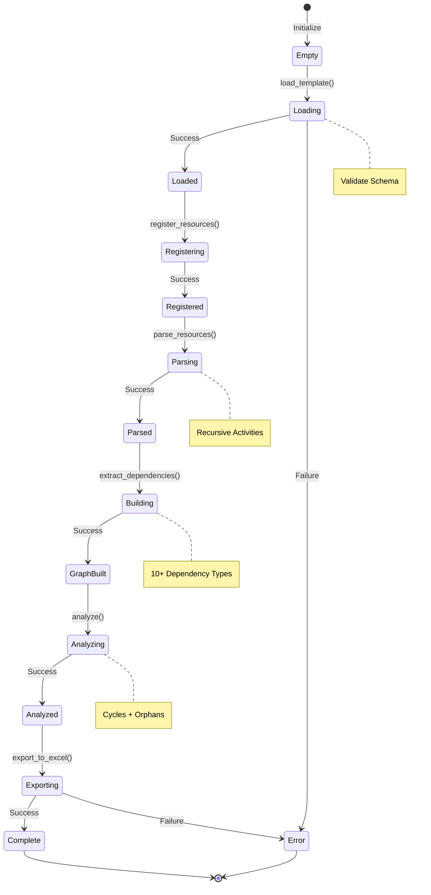

---

## 📊 SECTION 3: DEPENDENCY GRAPH ARCHITECTURE

### 3.1 Ten Dependency Types Visualization

```mermaid
flowchart TB
    subgraph TYPES["🔗 DEPENDENCY TYPES"]
        direction TB
        
        subgraph ACTIVITY["Activity Level"]
            T1["1️⃣ activity → activity"]
            T2["2️⃣ activity → dataset"]
        end
        
        subgraph PIPELINE["Pipeline Level"]
            T3["3️⃣ pipeline → pipeline"]
            T4["4️⃣ pipeline → dataflow"]
        end
        
        subgraph TRIGGER["Trigger Level"]
            T5["5️⃣ trigger → pipeline"]
        end
        
        subgraph DATAFLOW["DataFlow Level"]
            T6["6️⃣ dataflow → dataset"]
            T7["7️⃣ dataflow → linkedservice"]
        end
        
        subgraph RESOURCE["Resource Level"]
            T8["8️⃣ dataset → linkedservice"]
            T9["9️⃣ linkedservice → ir"]
            T10["🔟 arm_depends_on"]
        end
    end

    style ACTIVITY fill:#E3F2FD,stroke:#1976D2,stroke-width:2px
    style PIPELINE fill:#E8F5E9,stroke:#4CAF50,stroke-width:2px
    style TRIGGER fill:#FFF3E0,stroke:#FF9800,stroke-width:2px
    style DATAFLOW fill:#FCE4EC,stroke:#E91E63,stroke-width:2px
    style RESOURCE fill:#F3E5F5,stroke:#9C27B0,stroke-width:2px
```

### 3.2 Full Resource Dependency Network

```mermaid
flowchart LR
    subgraph TRIGGERS["⏰ TRIGGERS"]
        T1((T1))
        T2((T2))
    end

    subgraph PIPELINES["🔄 PIPELINES"]
        P1((P1))
        P2((P2))
        P3((P3))
    end

    subgraph ACTIVITIES["âš¡ ACTIVITIES"]
        A1((A1))
        A2((A2))
        A3((A3))
        A4((A4))
    end

    subgraph DATAFLOWS["💧 DATAFLOWS"]
        DF1((DF1))
        DF2((DF2))
    end

    subgraph DATASETS["📊 DATASETS"]
        DS1((DS1))
        DS2((DS2))
        DS3((DS3))
    end

    subgraph LINKEDSERVICES["🔗 LINKED SERVICES"]
        LS1((LS1))
        LS2((LS2))
    end

    subgraph RUNTIMES["🖥️ INTEGRATION RUNTIMES"]
        IR1((IR1))
        IR2((IR2))
    end

    T1 --> P1
    T2 --> P2
    
    P1 --> A1
    P1 --> A2
    P2 --> A3
    P3 --> A4
    
    A1 --> A2
    A2 --> DF1
    A3 --> DS1
    A4 --> P3
    
    DF1 --> DS1
    DF1 --> DS2
    DF2 --> DS3
    
    DS1 --> LS1
    DS2 --> LS1
    DS3 --> LS2
    
    LS1 --> IR1
    LS2 --> IR2

    style TRIGGERS fill:#FFECB3,stroke:#FF8F00,stroke-width:2px
    style PIPELINES fill:#FFCDD2,stroke:#D32F2F,stroke-width:2px
    style ACTIVITIES fill:#BBDEFB,stroke:#1976D2,stroke-width:2px
    style DATAFLOWS fill:#C8E6C9,stroke:#388E3C,stroke-width:2px
    style DATASETS fill:#D1C4E9,stroke:#512DA8,stroke-width:2px
    style LINKEDSERVICES fill:#B2EBF2,stroke:#0097A7,stroke-width:2px
    style RUNTIMES fill:#F5F5F5,stroke:#616161,stroke-width:2px
```

---

## 📊 SECTION 4: TOPOLOGICAL EXECUTION ORDERING

### 4.1 BFS Algorithm Flow

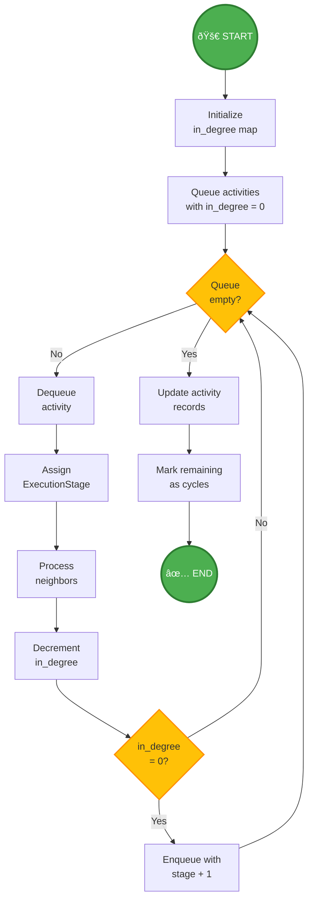

### 4.2 Execution Stage Levels Visualization

```mermaid
flowchart TB
    subgraph STAGE0["🟢 STAGE 0 — No Dependencies"]
        direction LR
        S0A["Lookup1"]
        S0B["Lookup2"]
        S0C["GetParams"]
    end

    subgraph STAGE1["🟡 STAGE 1"]
        direction LR
        S1A["ForEach1"]
        S1B["ForEach2"]
    end

    subgraph STAGE2["🟠 STAGE 2"]
        direction LR
        S2A["Copy1"]
        S2B["Copy2"]
        S2C["IfCondition"]
    end

    subgraph STAGE3["🔴 STAGE 3"]
        direction LR
        S3A["Transform1"]
        S3B["Transform2"]
        S3C["StoredProc"]
    end

    subgraph STAGE4["🟣 STAGE 4 — Final"]
        direction LR
        S4A["Wait"]
        S4B["Complete"]
    end

    S0A --> S1A
    S0B --> S1A
    S0C --> S1B
    
    S1A --> S2A
    S1A --> S2B
    S1B --> S2C
    
    S2A --> S3A
    S2B --> S3B
    S2C --> S3C
    
    S3A --> S4A
    S3B --> S4A
    S3C --> S4B

    style STAGE0 fill:#C8E6C9,stroke:#2E7D32,stroke-width:3px
    style STAGE1 fill:#FFF9C4,stroke:#F9A825,stroke-width:3px
    style STAGE2 fill:#FFE0B2,stroke:#EF6C00,stroke-width:3px
    style STAGE3 fill:#FFCDD2,stroke:#C62828,stroke-width:3px
    style STAGE4 fill:#E1BEE7,stroke:#7B1FA2,stroke-width:3px
```

---

## 📊 SECTION 5: RECURSIVE ACTIVITY PARSING

### 5.1 Nested Container Structure

```mermaid
flowchart TD
    subgraph PIPELINE["📦 Pipeline: pl_Master"]
        subgraph DEPTH0["Depth 0"]
            D0A["🔍 Lookup<br/>seq=0"]
            D0B["🔁 ForEach<br/>seq=1"]
            D0C["⏳ Wait<br/>seq=6"]
        end
        
        subgraph DEPTH1["Depth 1 — Inside ForEach"]
            D1A["📋 Copy1<br/>seq=2"]
            D1B["❓ IfCondition<br/>seq=3"]
        end
        
        subgraph DEPTH2["Depth 2 — Inside If"]
            subgraph TRUE["✅ ifTrue"]
                D2A["📋 Copy2<br/>seq=4"]
            end
            subgraph FALSE["❌ ifFalse"]
                D2B["📋 Copy3<br/>seq=5"]
            end
        end
    end

    D0A --> D0B
    D0B --> D1A
    D0B --> D1B
    D1B --> D2A
    D1B --> D2B
    D1A --> D0C
    D2A --> D0C
    D2B --> D0C

    style DEPTH0 fill:#E3F2FD,stroke:#1565C0,stroke-width:3px
    style DEPTH1 fill:#E8F5E9,stroke:#2E7D32,stroke-width:3px
    style DEPTH2 fill:#FFF8E1,stroke:#FF8F00,stroke-width:3px
    style TRUE fill:#C8E6C9,stroke:#388E3C,stroke-width:2px
    style FALSE fill:#FFCDD2,stroke:#D32F2F,stroke-width:2px
```

### 5.2 Container Type Dispatch

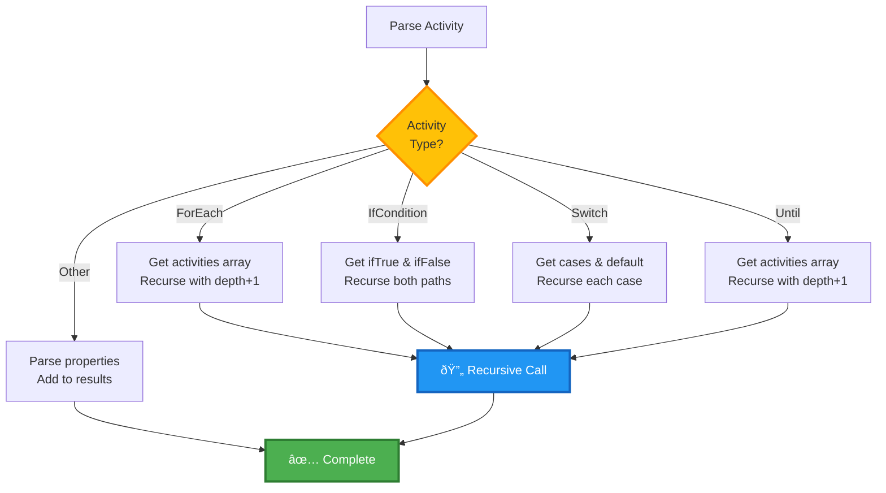

---

## 📊 SECTION 6: MONKEY PATCHING ARCHITECTURE

### 6.1 Patch Injection Sequence

```mermaid
sequenceDiagram
    autonumber
    
    participant R as 🖥️ Runner
    participant P as 🧩 Patch Module
    participant C as 📦 Analyzer Class
    
    rect rgb(227, 242, 253)
        Note over R,C: Phase 1: Import & Prepare
        R->>P: Import patch module
        R->>P: Call apply_all_patches()
        P->>C: Import analyzer class
    end
    
    rect rgb(232, 245, 233)
        Note over P,C: Phase 2: Inject Parsers
        P->>C: Inject Databricks parser
        P->>C: Inject AzureFunction parser
        P->>C: Inject HDInsight parser
        P->>C: Inject Salesforce parser
    end
    
    rect rgb(255, 243, 224)
        Note over P,C: Phase 3: Override Dispatcher
        P->>C: Save original parse_activity
        P->>C: Replace with enhanced dispatcher
    end
    
    rect rgb(252, 228, 236)
        Note over P,C: Phase 4: Enhance Datasets
        P->>C: Inject dataset location enhancer
    end
    
    P-->>R: ✅ Patching complete
    
    rect rgb(243, 229, 245)
        Note over R,C: Phase 5: Instantiate
        R->>C: Create analyzer instance
        Note over C: All patches active
    end
```

### 6.2 Before vs After Patching

```mermaid
flowchart LR
    subgraph BEFORE["🔵 BEFORE PATCHING"]
        direction TB
        B1["Base Class"]
        B2["19 Parsers"]
        B3["Original Dispatcher"]
    end

    subgraph PATCH["🟢 PATCH PROCESS"]
        direction TB
        P1["+ Databricks"]
        P2["+ AzureFunction"]
        P3["+ HDInsight"]
        P4["+ Salesforce"]
        P5["+ Dataset Enhance"]
        P6["Override Dispatcher"]
    end

    subgraph AFTER["🟣 AFTER PATCHING"]
        direction TB
        A1["Enhanced Class"]
        A2["26 Parsers"]
        A3["Enhanced Dispatcher"]
    end

    BEFORE --> PATCH
    PATCH --> AFTER

    style BEFORE fill:#BBDEFB,stroke:#1565C0,stroke-width:3px
    style PATCH fill:#C8E6C9,stroke:#2E7D32,stroke-width:3px
    style AFTER fill:#E1BEE7,stroke:#7B1FA2,stroke-width:3px
```

### 6.3 Enhanced Dispatcher Logic

```mermaid
flowchart TD
    CALL["parse_activity() called"] --> ORIG["Call original parser"]
    ORIG --> RESULT["Get base result"]
    RESULT --> CHECK{"Check<br/>activity type"}
    
    CHECK -->|Databricks*| DB["🧱 Databricks Parser<br/>notebook, jar, python"]
    CHECK -->|AzureFunction| AF["âš¡ AzureFunction Parser<br/>name, method, body"]
    CHECK -->|HDInsight*| HD["🔷 HDInsight Parser<br/>jar, class, args"]
    CHECK -->|Salesforce*| SF["☁️ Salesforce Parser<br/>soql, object"]
    CHECK -->|Other| RET["Return base result"]
    
    DB --> MERGE["Merge properties"]
    AF --> MERGE
    HD --> MERGE
    SF --> MERGE
    MERGE --> RET

    style CHECK fill:#FFC107,stroke:#FF8F00,stroke-width:3px
    style DB fill:#FF7043,stroke:#E64A19,stroke-width:2px,color:#fff
    style AF fill:#7E57C2,stroke:#512DA8,stroke-width:2px,color:#fff
    style HD fill:#42A5F5,stroke:#1976D2,stroke-width:2px,color:#fff
    style SF fill:#26C6DA,stroke:#00838F,stroke-width:2px,color:#fff
```

---

## 📊 SECTION 7: EXCEL EXPORT PIPELINE

### 7.1 Export Process Flow

```mermaid
flowchart TD
    subgraph PREPARE["📋 PREPARE"]
        P1["Convert results<br/>to DataFrames"]
        P2["Apply sorting"]
        P3["Apply column hiding"]
    end

    subgraph WRITE["💾 WRITE"]
        W1["Create Excel writer"]
        W2["Write core sheets"]
        W3["Auto-split large sheets"]
    end

    subgraph ENHANCE["🎨 ENHANCE"]
        E1["Apply styling"]
        E2["Add formatting"]
        E3["Insert hyperlinks"]
        E4["Build dashboard"]
    end

    subgraph OUTPUT["📤 OUTPUT"]
        O1["Save workbook"]
        O2["Create archive"]
        O3["Copy to Streamlit"]
    end

    P1 --> P2 --> P3 --> W1
    W1 --> W2 --> W3 --> E1
    E1 --> E2 --> E3 --> E4 --> O1
    O1 --> O2 --> O3

    style PREPARE fill:#E3F2FD,stroke:#1565C0,stroke-width:3px
    style WRITE fill:#E8F5E9,stroke:#2E7D32,stroke-width:3px
    style ENHANCE fill:#FFF3E0,stroke:#EF6C00,stroke-width:3px
    style OUTPUT fill:#F3E5F5,stroke:#7B1FA2,stroke-width:3px
```

### 7.2 Auto-Split Logic for Large Sheets

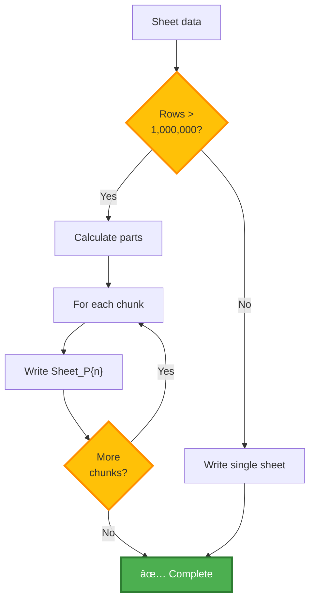

### 7.3 Excel Sheet Organization

```mermaid
flowchart TB
    subgraph CORE["📊 CORE SHEETS"]
        direction LR
        C1["PipelineAnalysis"]
        C2["Pipelines"]
        C3["Activities ⭐"]
        C4["ActivityExecutionOrder ⭐"]
    end

    subgraph DATAFLOW["💧 DATAFLOW SHEETS"]
        direction LR
        D1["DataFlows"]
        D2["DataFlowLineage"]
        D3["DataFlowTransformations"]
    end

    subgraph RESOURCE["📦 RESOURCE SHEETS"]
        direction LR
        R1["Datasets"]
        R2["LinkedServices"]
        R3["IntegrationRuntimes"]
        R4["Triggers"]
    end

    subgraph ANALYSIS["📈 ANALYSIS SHEETS"]
        direction LR
        A1["Dependencies"]
        A2["CircularDependencies"]
        A3["ImpactAnalysis"]
        A4["DataLineage"]
    end

    subgraph ORPHAN["⚠️ ORPHAN SHEETS"]
        direction LR
        O1["OrphanedPipelines"]
        O2["OrphanedDatasets"]
        O3["OrphanedLinkedServices"]
    end

    subgraph USAGE["📊 USAGE SHEETS"]
        direction LR
        U1["DatasetUsage"]
        U2["LinkedServiceUsage"]
        U3["IntegrationRuntimeUsage"]
    end

    style CORE fill:#E3F2FD,stroke:#1565C0,stroke-width:3px
    style DATAFLOW fill:#E8F5E9,stroke:#2E7D32,stroke-width:3px
    style RESOURCE fill:#FFF3E0,stroke:#EF6C00,stroke-width:3px
    style ANALYSIS fill:#FCE4EC,stroke:#C2185B,stroke-width:3px
    style ORPHAN fill:#FFF8E1,stroke:#F57F17,stroke-width:3px
    style USAGE fill:#F3E5F5,stroke:#7B1FA2,stroke-width:3px
```

---

## 📊 SECTION 8: ENHANCEMENT LAYER ARCHITECTURE

### 8.1 Enhancement Pipeline Flow

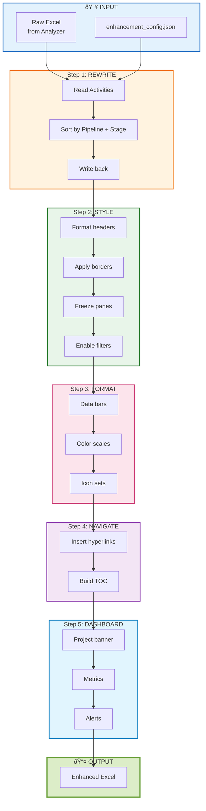

### 8.2 Enhancement Configuration Decision Tree

```mermaid
flowchart TD
    CONFIG["Load Config"] --> ENABLED{"enabled?"}
    
    ENABLED -->|No| SKIP["Skip all<br/>Return raw"]
    ENABLED -->|Yes| CORE{"core_formatting?"}
    
    CORE -->|Yes| APPLYSTYLE["✅ Apply styling"]
    CORE -->|No| SKIPSTYLE["⏭️ Skip styling"]
    
    APPLYSTYLE --> COND
    SKIPSTYLE --> COND
    
    COND{"conditional<br/>formatting?"}
    COND -->|Yes| APPLYFORMAT["✅ Apply formats"]
    COND -->|No| SKIPFORMAT["⏭️ Skip formats"]
    
    APPLYFORMAT --> LINKS
    SKIPFORMAT --> LINKS
    
    LINKS{"hyperlinks?"}
    LINKS -->|Yes| APPLYLINKS["✅ Apply links"]
    LINKS -->|No| SKIPLINKS["⏭️ Skip links"]
    
    APPLYLINKS --> SUMM
    SKIPLINKS --> SUMM
    
    SUMM{"enhanced<br/>summary?"}
    SUMM -->|Yes| APPLYSUMM["✅ Apply summary"]
    SUMM -->|No| SKIPSUMM["⏭️ Skip summary"]
    
    APPLYSUMM --> DONE["Output enhanced Excel"]
    SKIPSUMM --> DONE
    SKIP --> DONE

    style ENABLED fill:#FFC107,stroke:#FF8F00,stroke-width:2px
    style CORE fill:#FFC107,stroke:#FF8F00,stroke-width:2px
    style COND fill:#FFC107,stroke:#FF8F00,stroke-width:2px
    style LINKS fill:#FFC107,stroke:#FF8F00,stroke-width:2px
    style SUMM fill:#FFC107,stroke:#FF8F00,stroke-width:2px
    style DONE fill:#4CAF50,stroke:#2E7D32,stroke-width:3px,color:#fff
```

---

## 📊 SECTION 9: CLI EXECUTION MODES

### 9.1 Four Execution Mode Comparison

```mermaid
flowchart TB
    subgraph MODE1["🔵 BASIC MODE<br/>--basic"]
        direction TB
        M1A["Skip functional patches"]
        M1B["Skip Excel enhancements"]
        M1C["Base analyzer only"]
        M1D["Plain Excel output"]
    end

    subgraph MODE2["🟢 FUNCTIONAL ONLY<br/>--skip-excel-enhancements"]
        direction TB
        M2A["Apply functional patches"]
        M2B["Skip Excel enhancements"]
        M2C["Extended parsers active"]
        M2D["Plain Excel output"]
    end

    subgraph MODE3["🟡 EXCEL ONLY<br/>--skip-functional"]
        direction TB
        M3A["Skip functional patches"]
        M3B["Apply Excel enhancements"]
        M3C["Base parsers only"]
        M3D["Styled Excel output"]
    end

    subgraph MODE4["🟣 FULL PRODUCTION<br/>(default)"]
        direction TB
        M4A["Apply functional patches"]
        M4B["Apply Excel enhancements"]
        M4C["All parsers active"]
        M4D["Fully enhanced Excel"]
    end

    style MODE1 fill:#BBDEFB,stroke:#1565C0,stroke-width:3px
    style MODE2 fill:#C8E6C9,stroke:#2E7D32,stroke-width:3px
    style MODE3 fill:#FFF9C4,stroke:#F9A825,stroke-width:3px
    style MODE4 fill:#E1BEE7,stroke:#7B1FA2,stroke-width:3px
```

### 9.2 CLI Decision Flow

```mermaid
flowchart TD
    START["User runs CLI"] --> PARSE["Parse arguments"]
    PARSE --> BASIC{"--basic<br/>flag?"}
    
    BASIC -->|Yes| SKIPALL["Skip all patches<br/>Skip all enhancements"]
    BASIC -->|No| CHECKF{"--skip-functional?"}
    
    CHECKF -->|Yes| SKIPFUNC["Skip functional patches"]
    CHECKF -->|No| APPLYFUNC["Apply functional patches"]
    
    SKIPFUNC --> CHECKE{"--skip-excel?"}
    APPLYFUNC --> CHECKE
    
    CHECKE -->|Yes| SKIPEXCEL["Skip Excel enhancements"]
    CHECKE -->|No| APPLYEXCEL["Apply Excel enhancements"]
    
    SKIPALL --> RUN
    SKIPEXCEL --> RUN
    APPLYEXCEL --> RUN
    
    RUN["Run analyzer"] --> OUTPUT["Generate Excel"]

    style BASIC fill:#FFC107,stroke:#FF8F00,stroke-width:2px
    style CHECKF fill:#FFC107,stroke:#FF8F00,stroke-width:2px
    style CHECKE fill:#FFC107,stroke:#FF8F00,stroke-width:2px
    style OUTPUT fill:#4CAF50,stroke:#2E7D32,stroke-width:3px,color:#fff
```

---

## 📊 SECTION 10: DATA LINEAGE TRACEABILITY

### 10.1 End-to-End Data Lineage Chain

```mermaid
flowchart LR
    subgraph TRIGGER["⏰ TRIGGER"]
        T["Schedule<br/>Every 15 min"]
    end

    subgraph PIPELINE1["🔄 MASTER PIPELINE"]
        P1["pl_Master"]
    end

    subgraph ACTIVITIES1["âš¡ ACTIVITIES"]
        A1["Lookup"]
        A2["ExecutePipeline"]
        A3["ExecuteDataFlow"]
    end

    subgraph PIPELINE2["🔄 CHILD PIPELINE"]
        P2["pl_Child"]
    end

    subgraph ACTIVITIES2["âš¡ CHILD ACTIVITIES"]
        A4["Copy"]
    end

    subgraph DATAFLOW["💧 DATAFLOW"]
        DF["df_Transform"]
    end

    subgraph DATASETS["📊 DATASETS"]
        DS1["Source"]
        DS2["Staging"]
        DS3["Target"]
    end

    subgraph LINKEDSERVICES["🔗 LINKED SERVICES"]
        LS1["ls_Source"]
        LS2["ls_Target"]
    end

    subgraph RUNTIMES["🖥️ RUNTIMES"]
        IR1["Azure IR"]
        IR2["Self-hosted IR"]
    end

    T --> P1
    P1 --> A1
    P1 --> A2
    P1 --> A3
    A2 --> P2
    P2 --> A4
    A4 --> DS1
    A4 --> DS2
    A3 --> DF
    DF --> DS2
    DF --> DS3
    DS1 --> LS1
    DS2 --> LS2
    DS3 --> LS2
    LS1 --> IR1
    LS2 --> IR2

    style TRIGGER fill:#FFECB3,stroke:#FF8F00,stroke-width:3px
    style PIPELINE1 fill:#FFCDD2,stroke:#D32F2F,stroke-width:3px
    style PIPELINE2 fill:#FFCDD2,stroke:#D32F2F,stroke-width:2px
    style DATAFLOW fill:#C8E6C9,stroke:#388E3C,stroke-width:3px
    style DATASETS fill:#D1C4E9,stroke:#512DA8,stroke-width:3px
    style LINKEDSERVICES fill:#B2EBF2,stroke:#0097A7,stroke-width:3px
    style RUNTIMES fill:#F5F5F5,stroke:#616161,stroke-width:3px
```

---

## 📊 SECTION 11: CYCLE DETECTION ALGORITHM

### 11.1 Tarjan's SCC Algorithm Flow

```mermaid
flowchart TD
    START(("🚀 START")) --> INIT["Initialize<br/>index, lowlink, stack"]
    INIT --> FORALL["For each node"]
    FORALL --> VISITED{"Node<br/>visited?"}
    
    VISITED -->|No| STRONG["strongconnect(node)"]
    VISITED -->|Yes| NEXT["Next node"]
    NEXT --> DONE{"All nodes<br/>processed?"}
    
    DONE -->|No| FORALL
    DONE -->|Yes| RESULT["Return SCC list"]
    
    STRONG --> SETINDEX["Set index, lowlink"]
    SETINDEX --> PUSH["Push to stack"]
    PUSH --> NEIGHBORS["For each neighbor"]
    NEIGHBORS --> NVISITED{"Neighbor<br/>visited?"}
    
    NVISITED -->|No| RECURSE["Recurse neighbor"]
    NVISITED -->|Yes, on stack| UPDATE["Update lowlink"]
    
    RECURSE --> UPDATEMIN["lowlink = min(...)"]
    UPDATE --> UPDATEMIN
    UPDATEMIN --> MOREN{"More<br/>neighbors?"}
    
    MOREN -->|Yes| NEIGHBORS
    MOREN -->|No| ISROOT{"Is root?<br/>lowlink = index"}
    
    ISROOT -->|Yes| POP["Pop SCC<br/>from stack"]
    ISROOT -->|No| RETURN["Return"]
    
    POP --> RECORD["Record cycle<br/>if size > 1"]
    RECORD --> RETURN
    RETURN --> FORALL

    RESULT --> FINISH(("✅ END"))

    style START fill:#4CAF50,stroke:#2E7D32,stroke-width:3px,color:#fff
    style FINISH fill:#4CAF50,stroke:#2E7D32,stroke-width:3px,color:#fff
    style VISITED fill:#FFC107,stroke:#FF8F00,stroke-width:2px
    style NVISITED fill:#FFC107,stroke:#FF8F00,stroke-width:2px
    style DONE fill:#FFC107,stroke:#FF8F00,stroke-width:2px
    style MOREN fill:#FFC107,stroke:#FF8F00,stroke-width:2px
    style ISROOT fill:#FFC107,stroke:#FF8F00,stroke-width:2px
```

---

## 📊 SECTION 12: COMPLETE SYSTEM SUMMARY

### 12.1 System Architecture Overview

```mermaid
flowchart TB
    subgraph USER["👤 USER"]
        CLI["python patched_runner.py<br/>template.json"]
    end

    subgraph ORCHESTRATOR["🎛️ ORCHESTRATOR"]
        RUNNER["Patched Runner"]
        ARGS["Parse Args"]
    end

    subgraph EXTENSIONS["🔌 EXTENSIONS"]
        FP["Functional Patches<br/>+7 parsers"]
        EP["Excel Enhancements<br/>styling + dashboards"]
    end

    subgraph ENGINE["⚙️ CORE ENGINE"]
        PHASE["8 Processing Phases"]
    end

    subgraph OUTPUTS["📤 OUTPUTS"]
        EXCEL["📊 Excel Workbook"]
        ARCHIVE["🗄️ Archive Copy"]
        STCOPY["📁 Streamlit Copy"]
    end

    subgraph CONSUMERS["👥 CONSUMERS"]
        MANUAL["Manual Review"]
        VALID["Validation Scripts"]
        STREAM["Streamlit Dashboard<br/>(out of scope)"]
    end

    CLI --> RUNNER
    RUNNER --> ARGS
    ARGS --> FP
    ARGS --> EP
    FP --> PHASE
    EP --> PHASE
    PHASE --> EXCEL
    EXCEL --> ARCHIVE
    EXCEL --> STCOPY
    EXCEL --> MANUAL
    EXCEL --> VALID
    STCOPY -.-> STREAM

    style USER fill:#E3F2FD,stroke:#1565C0,stroke-width:3px
    style ORCHESTRATOR fill:#FFF3E0,stroke:#EF6C00,stroke-width:3px
    style EXTENSIONS fill:#E8F5E9,stroke:#2E7D32,stroke-width:3px
    style ENGINE fill:#FCE4EC,stroke:#C2185B,stroke-width:3px
    style OUTPUTS fill:#F3E5F5,stroke:#7B1FA2,stroke-width:3px
    style CONSUMERS fill:#E1F5FE,stroke:#0277BD,stroke-width:3px
```

### 12.2 File Responsibility Summary

```mermaid
flowchart LR
    subgraph FILES["📁 CORE FILES"]
        F1["adf_analyzer_v10_complete.py<br/>⚙️ Core Engine"]
        F2["adf_analyzer_v10_patch.py<br/>🧩 Extensions"]
        F3["adf_analyzer_v10_patched_runner.py<br/>🎛️ Orchestrator"]
        F4["adf_analyzer_v10_excel_enhancements.py<br/>🎨 Beautification"]
    end

    subgraph ROLES["🎯 ROLES"]
        R1["ARM parsing<br/>Dependency graphs<br/>Topological sort<br/>Excel export"]
        R2["Activity parsers<br/>Dataset parsers<br/>Dispatcher override"]
        R3["CLI handling<br/>Patch control<br/>Execution flow"]
        R4["Styling<br/>Formatting<br/>Dashboards"]
    end

    F1 --> R1
    F2 --> R2
    F3 --> R3
    F4 --> R4

    style F1 fill:#FCE4EC,stroke:#C2185B,stroke-width:3px
    style F2 fill:#E8F5E9,stroke:#2E7D32,stroke-width:3px
    style F3 fill:#FFF3E0,stroke:#EF6C00,stroke-width:3px
    style F4 fill:#E3F2FD,stroke:#1565C0,stroke-width:3px
```

---

## 📋 DIAGRAM TYPE REFERENCE

| Section | Diagram Type | Purpose |
|---------|--------------|---------|
| 1.1 | Block Diagram | High-level system view |
| 1.2 | Layered Flowchart | Component architecture |
| 2.1 | Horizontal Pipeline | Phase progression |
| 2.2 | Vertical Hierarchy | Resource dependencies |
| 2.3 | State Diagram | Processing states |
| 3.1-3.2 | Network Graph | Dependency visualization |
| 4.1 | Algorithm Flowchart | BFS logic |
| 4.2 | Staged Flowchart | Execution levels |
| 5.1-5.2 | Nested Flowchart | Recursive structure |
| 6.1 | Sequence Diagram | Runtime interaction |
| 6.2-6.3 | Transformation Flowchart | Patch mechanism |
| 7.1-7.3 | Pipeline Flowchart | Export process |
| 8.1-8.2 | Decision Tree | Configuration logic |
| 9.1-9.2 | Comparison Flowchart | Mode differences |
| 10.1 | Lineage Graph | Data traceability |
| 11.1 | Algorithm Flowchart | Tarjan's SCC |
| 12.1-12.2 | Summary Flowchart | System overview |

---

**Document Version:** 3.0 Advanced Edition  
**Diagram Syntax:** Validated Mermaid 10.x  
**Last Updated:** January 19, 2026

**The generated Excel workbook is later consumed by a Streamlit-based visualization layer, which is under active development and intentionally out of scope for this document.**

