<!-- ================== PROJECT THUMBNAIL ================== -->
<p align="center">
  
</p>

<!-- ================== ANIMATED SHOWCASE HEADER ================== -->
<p align="center">
  
</p>

<!-- ================== STATUS BADGES ================== -->
<p align="center">
  
  &nbsp;
  
  &nbsp;
  
</p>

<br>


# 🚀 ADF Analyzer v10.1
### Ultimate Interactive Edition

<br>

[](https://github.com/AvinashAnalytics/Azure-Data-Factory-Analyzer-Ultimate-Interactive-Edition)
[](https://www.python.org/)
[](LICENSE)
[](https://streamlit.io/)
[](https://azure.microsoft.com/en-us/services/data-factory/)

<br>

**Enterprise-grade toolkit for Azure Data Factory ARM template analysis**  
**Interactive Dashboard • Comprehensive Excel Reporting • Advanced Analytics**

<br>

[🎯 Overview](#-overview) • [⚡ Quick Start](#-quick-start) • [🏗️ Architecture](#️-architecture) • [📊 Features](#-key-features) • [📚 Documentation](#-documentation)

</div>

<br>

---

<!-- ================== SHOWCASE NOTICE BOX ================== -->

<table align="center" width="90%">
<tr>
<td>

<div align="center">

## 📋 SHOWCASE NOTICE — Documentation-Only Repository

</div>

<br>

<blockquote>

🔐 **This repository is provided as a professional documentation and demonstration showcase** for the ADF Analyzer project.

The **full implementation source code is private and proprietary** and is not published here.

</blockquote>

<br>

### ✅ This Repository Contains:

<table align="center">
<tr>
<td align="center">📖</td>
<td><strong>Documentation</strong></td>
<td align="center">📊</td>
<td><strong>Architecture Diagrams</strong></td>
</tr>
<tr>
<td align="center">📁</td>
<td><strong>Output Artifacts</strong></td>
<td align="center">🎬</td>
<td><strong>Usage Demonstrations</strong></td>
</tr>
</table>

<br>

### 📬 Contact for Source Code Access or Walkthrough

<div align="center">

| | Channel | Contact |
|:-:|:-------:|:--------|
| 📧 | **Email** | [masteravinashrai@gmail.com](mailto:masteravinashrai@gmail.com) |
| 💼 | **LinkedIn** | [linkedin.com/in/avinashanalytics](https://www.linkedin.com/in/avinashanalytics/) |

</div>

<br>

</td>
</tr>
</table>

<br>

---

<br>


# ADF Analyzer v10.1 - Ultimate Interactive Edition

---

<div align="center">

# 🚀 ADF Analyzer v10.1
### Ultimate Interactive Edition

<br>

[](https://github.com/AvinashAnalytics/Azure-Data-Factory-Analyzer-Ultimate-Interactive-Edition)
[](https://www.python.org/)
[](LICENSE)
[](https://streamlit.io/)
[](https://azure.microsoft.com/en-us/services/data-factory/)

<br>

**Enterprise-grade toolkit for Azure Data Factory ARM template analysis**  
**Interactive Dashboard • Comprehensive Excel Reporting • Advanced Analytics**

<br>

[🎯 Overview](#-overview) • [⚡ Quick Start](#-quick-start) • [🏗️ Architecture](#️-architecture) • [📊 Features](#-key-features) • [📚 Documentation](#-documentation)

---

</div>

<br>

> ## 📋 SHOWCASE NOTICE — Documentation-Only Repository
> 
> This repository is provided as a **professional documentation and demonstration showcase** for the ADF Analyzer project. The full implementation source code is **private and proprietary** and is not published here.
> 
> The public repository intentionally contains documentation, architecture diagrams, output artifacts, and usage demonstrations only.
> 
> ### 📬 Contact
> 
> | Channel | Link |
> |---------|------|
> | 📧 **Email** | [masteravinashrai@gmail.com](mailto:masteravinashrai@gmail.com) |
> | 💼 **LinkedIn** | [linkedin.com/in/avinashanalytics](https://www.linkedin.com/in/avinashanalytics/) |

---

<br>

## 📑 TABLE OF CONTENTS

<table>
<tr>
<td width="50%" valign="top">

### 🎯 Getting Started
- [🎯 Overview](#-overview)
- [⚡ Quick Start](#-quick-start)
- [🏗️ Architecture](#️-architecture)
- [💡 Key Features](#-key-features)
- [📊 Dashboard Features](#-dashboard-features)

</td>
<td width="50%" valign="top">

### 🛠️ Advanced Topics
- [📋 File Structure](#-file-structure)
- [🔧 Installation & Setup](#-installation--setup)
- [🎮 Usage Guide](#-usage-guide)
- [📈 Output Examples](#-output-examples)
- [🛠️ Development](#️-development)
- [📚 Documentation](#-documentation)

</td>
</tr>
</table>

---

<br>

## 🎯 OVERVIEW

<div align="center">

### What is ADF Analyzer?

</div>

**ADF Analyzer v10.1** is an **enterprise-grade toolkit** designed to parse, analyze, and visualize Azure Data Factory (ADF) ARM templates with unprecedented speed and detail.

This version introduces a **modernized Streamlit dashboard** with dual-mode operation, comprehensive documentation system, and professional Excel reporting capabilities.

<br>

### ✨ What's New in v10.1

<table>
<tr>
<td align="center" width="33%">

### 🎛️ Dual-Mode Dashboard
Choose between **"Generate Excel"** and **"Upload & Analyze"** workflows

</td>
<td align="center" width="33%">

### 🔧 Wrapper System
Production-ready `adf_runner_wrapper.py` with **Unicode handling** and auto-discovery

</td>
<td align="center" width="33%">

### 📊 Enhanced Documentation
Complete **in-app documentation** with 5 comprehensive sections

</td>
</tr>
<tr>
<td align="center" width="33%">

### 🎨 Modern UI
Streamlined interface with **enhancement configuration** management

</td>
<td align="center" width="33%">

### 📈 Advanced Analytics
**Dependency tracking**, lineage analysis, and impact assessment

</td>
<td align="center" width="33%">

### 🔍 Comprehensive Validation
Built-in **verification system** with detailed reports

</td>
</tr>
</table>

<br>

### 📦 Supported Resources

<table>
<tr>
<th>Category</th>
<th>Count</th>
<th>Examples</th>
</tr>
<tr>
<td>

**⚡ Activities**

</td>
<td align="center">

`44+`

</td>
<td>

Copy, DataFlow, Lookup, Execute Pipeline, Databricks, Azure Function

</td>
</tr>
<tr>
<td>

**📊 Datasets**

</td>
<td align="center">

`25+`

</td>
<td>

SQL Server, Blob Storage, CosmosDB, BigQuery, Office365

</td>
</tr>
<tr>
<td>

**🔗 Linked Services**

</td>
<td align="center">

`15+`

</td>
<td>

Azure SQL, Storage Account, Key Vault, Databricks

</td>
</tr>
<tr>
<td>

**⏰ Triggers**

</td>
<td align="center">

`7+`

</td>
<td>

Schedule, Tumbling Window, Event-based, Manual

</td>
</tr>
<tr>
<td>

**🔧 Others**

</td>
<td align="center">

`20+`

</td>
<td>

Integration Runtimes, Managed VNets, Private Endpoints

</td>
</tr>
</table>

---

<br>

## ⚡ QUICK START

<div align="center">

### 🚀 5-Minute Setup

</div>

```bash
# 1️⃣ Clone or download the repository
git clone https://github.com/AvinashAnalytics/Azure-Data-Factory-Analyzer-Ultimate-Interactive-Edition.git
cd Azure-Data-Factory-Analyzer-Ultimate-Interactive-Edition/ADF_Analyzer_v10_Production

# 2️⃣ Install dependencies
pip install streamlit pandas openpyxl plotly networkx

# 3️⃣ Quick analysis (recommended entry point)
python adf_runner_wrapper.py your_template.json

# 4️⃣ Launch interactive dashboard
streamlit run adf_dashboard.py
```

<br>

### 🎯 Entry Points

| Method | Use Case | Command |
|:------:|:---------|:--------|
| 🚀 | **Wrapper (Recommended)** — Production analysis | `python adf_runner_wrapper.py template.json` |
| 🎛️ | **Dashboard** — Interactive analysis | `streamlit run adf_dashboard.py` |
| 🔧 | **Patched Runner** — Enhanced analysis | `python adf_analyzer_v10_patched_runner.py template.json` |
| ⚙️ | **Direct Engine** — Core analysis only | `python adf_analyzer_v10_complete.py template.json` |

---

<br>

## 🏗️ ARCHITECTURE

<div align="center">

### System Architecture

</div>

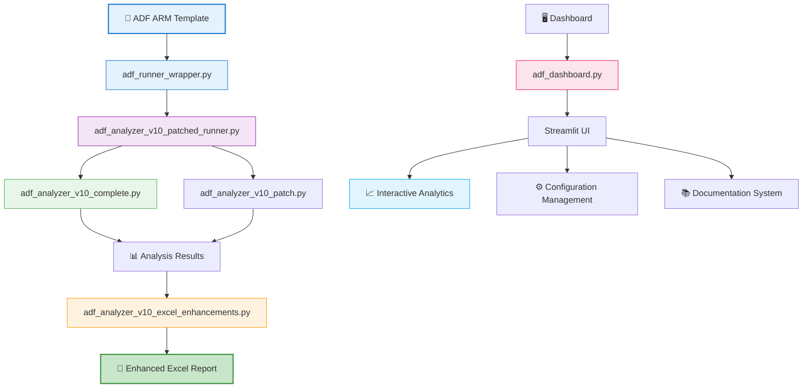

<br>

### 🧩 Component Relationships

<table>
<tr>
<td width="20%" align="center">

**🔧**
### Wrapper Layer

</td>
<td width="80%">

`adf_runner_wrapper.py` — Safe execution with Unicode handling and auto-discovery

</td>
</tr>
<tr>
<td align="center">

**🚀**
### Orchestrator

</td>
<td>

`adf_analyzer_v10_patched_runner.py` — Business logic coordination and patch management

</td>
</tr>
<tr>
<td align="center">

**🎯**
### Core Engine

</td>
<td>

`adf_analyzer_v10_complete.py` — ARM template parsing and dependency analysis

</td>
</tr>
<tr>
<td align="center">

**🎨**
### Enhancement

</td>
<td>

`adf_analyzer_v10_excel_enhancements.py` — Professional Excel output with styling

</td>
</tr>
<tr>
<td align="center">

**📊**
### Dashboard

</td>
<td>

`adf_dashboard.py` — Interactive Streamlit interface with real-time analytics

</td>
</tr>
</table>

---

<br>

## 💡 KEY FEATURES

<div align="center">

### 🔍 Analysis Capabilities

</div>

<table>
<tr>
<td width="50%" valign="top">

### 📊 Comprehensive Parsing

- ✅ All ADF resource types supported
- ✅ Activity detection and classification
- ✅ Dataset and linked service analysis
- ✅ Trigger processing and validation
- ✅ Integration runtime assessment

---

### 🔗 Dependency Analysis

- ✅ Complete dependency graph construction
- ✅ Circular dependency detection (DFS algorithm)
- ✅ Orphaned resource identification
- ✅ Impact analysis (BFS traversal)
- ✅ Lineage tracking and visualization

</td>
<td width="50%" valign="top">

### 🏥 Health Assessment

- ✅ Factory health score (0-100 scale)
- ✅ Quality score with deduction system
- ✅ Resource utilization metrics
- ✅ Performance bottleneck identification
- ✅ Security checklist validation

---

### 📈 Advanced Metrics

- ✅ Resource distribution analysis
- ✅ Complexity heat mapping
- ✅ Performance insights
- ✅ Cost optimization recommendations
- ✅ Best practices compliance

</td>
</tr>
</table>

<br>

### 📊 Excel Reporting Features

<div align="center">

| Feature | Description | Status |
|:-------:|:------------|:------:|
| 🎨 | **Core Formatting** — Professional styling, borders, colors | ✅ |
| 📊 | **Conditional Formatting** — Data bars, color scales, icon sets | ✅ |
| 🔗 | **Hyperlinks** — Navigation between sheets | ✅ |
| 📋 | **Enhanced Summary** — Executive dashboard with project banner | ✅ |
| 📈 | **Advanced Dashboard** — Health score, complexity maps, insights | ✅ |
| ⚡ | **Performance Analysis** — Bottleneck identification and recommendations | ✅ |
| 🔒 | **Security Assessment** — Comprehensive security checklist | ✅ |
| 💰 | **Cost Analysis** — Resource utilization and optimization | ✅ |

</div>

---

<br>

## 📊 DASHBOARD FEATURES

### 🎛️ Dual-Mode Operation

<table>
<tr>
<th width="50%">Mode 1: Generate Excel</th>
<th width="50%">Mode 2: Upload & Analyze</th>
</tr>
<tr>
<td valign="top">

```
📤 Upload ARM template
    ↓
⚙️ Configure enhancement options
    ↓
🔄 Generate professional Excel report
    ↓
📥 Download enhanced results
```

</td>
<td valign="top">

```
📤 Upload existing Excel analysis
    ↓
🔍 Interactive data exploration
    ↓
📊 Real-time analytics & visualizations
    ↓
📥 Export filtered results
```

</td>
</tr>
</table>

<br>

### 📚 Documentation System

The dashboard includes a comprehensive documentation system with **5 main sections**:

| Tab | Content | Purpose |
|:---:|:--------|:--------|
| 📋 | **Dashboard Tiles** | Metric definitions and data sources |
| 🧠 | **Technical Logic** | Algorithms and scoring methods |
| 🐍 | **Python Files** | Complete file structure overview |
| 📖 | **Complete Guide** | Project documentation and setup |
| ⚙️ | **Configuration** | Settings and customization |

<br>

### 🎨 Interactive Analytics

<div align="center">

| Feature | Description |
|:-------:|:------------|
| 📊 **Health Gauge** | Visual factory health indicator with real-time updates |
| 🕸️ **Network Graphs** | Interactive dependency visualization with zoom & pan |
| 📈 **Metric Tiles** | Real-time analytics with verification badges |
| 🔍 **Filtering** | Advanced filtering and search capabilities |
| 📥 **Export Options** | CSV, JSON, Excel export functionality |

</div>

---

<br>

## 📋 FILE STRUCTURE

```
ADF_Analyzer_v10_Production/
│
├── 🚀 Core Analysis Engine
│   ├── adf_analyzer_v10_complete.py           # Main analysis engine
│   ├── adf_analyzer_v10_patched_runner.py     # Orchestrator with patches
│   └── adf_runner_wrapper.py                  # Safe execution wrapper ⭐ RECOMMENDED
│
├── 🎨 Enhancements & Processing  
│   ├── adf_analyzer_v10_excel_enhancements.py # Excel beautification
│   └── adf_analyzer_v10_patch.py              # Functional patches
│
├── 📊 Dashboard & UI
│   ├── adf_dashboard.py                       # Main Streamlit dashboard
│   └── streamlit_app/                         # Application structure
│       └── data/                              # Application data
│
├── 🔧 Configuration & Settings
│   ├── config/
│   │   ├── enhancement_config.json            # Excel enhancement settings
│   │   ├── streamlit_config.json              # Dashboard configuration
│   │   └── settings.json                      # General settings
│   └── core/                                  # Core configuration
│
├── 🔧 Utilities & Scripts
│   └── scripts/
│       ├── setup_environment.py               # Environment setup
│       ├── run_analysis.py                    # Direct execution
│       └── verify_installation.py             # Validation
│
├── ✅ Testing & Validation
│   └── tests/
│       ├── test_metrics.py                    # Metrics testing
│       ├── test_metrics_enhanced.py           # Enhanced testing
│       ├── verify_real_world.py               # Real-world testing
│       └── TEST_RESULTS.py                    # Test results summary
│
├── 📤 Output
│   └── output/                                # Generated reports
│
├── 📚 Documentation
│   └── docs/
│       ├── TILES.md                           # Dashboard tiles reference
│       ├── LOGIC.md                           # Technical algorithms
│       ├── PYTHON_FILES_REFERENCE.md          # Complete file guide
│       ├── DOCUMENTATION_INDEX.md             # Master documentation index
│       └── FLOW.md                            # Architecture flow documentation
│
└── 📄 Root Files
    ├── README.md                              # This file
    ├── requirements.txt                       # Python dependencies
    ├── setup.py                               # Package setup
    ├── app.py                                 # Application entry
    └── adf.py                                 # Core ADF module
```

---
 Installation, Usage & Configuration

---

<br>

## 🔧 INSTALLATION & SETUP

<div align="center">

### Prerequisites

</div>

| Requirement | Specification | Notes |
|:-----------:|:--------------|:------|
| 🐍 | **Python 3.8+** | Recommended: 3.9 or 3.10 |
| 💻 | **OS** | Windows / Linux / macOS (Cross-platform) |
| 🧠 | **RAM** | 4GB minimum (8GB recommended for large templates) |

<br>

### 📦 Method 1: Direct Installation

```bash
# Install core dependencies
pip install streamlit pandas openpyxl plotly networkx

# Optional: Install additional packages for enhanced features
pip install matplotlib seaborn xlsxwriter

# Verify installation
python scripts/verify_installation.py
```

<br>

### 🔒 Method 2: Virtual Environment (Recommended)

<table>
<tr>
<th>Windows</th>
<th>Linux / macOS</th>
</tr>
<tr>
<td>

```powershell
# Create virtual environment
python -m venv adf_analyzer_env

# Activate environment
adf_analyzer_env\Scripts\activate

# Install dependencies
pip install -r requirements.txt
```

</td>
<td>

```bash
# Create virtual environment
python -m venv adf_analyzer_env

# Activate environment
source adf_analyzer_env/bin/activate

# Install dependencies
pip install -r requirements.txt
```

</td>
</tr>
</table>

<br>

### 🤖 Method 3: Using Setup Script

```bash
# Run automated setup
python scripts/setup_environment.py

# Follow interactive prompts for:
# ✅ Dependency installation
# ✅ Configuration setup
# ✅ Environment validation
```

---

<br>

## 🎮 USAGE GUIDE

### 💻 Command Line Usage

<br>

#### 🚀 Production Analysis (Recommended)

```bash
# Basic analysis
python adf_runner_wrapper.py your_template.json

# With custom output directory
python adf_runner_wrapper.py your_template.json --output ./reports

# Enhanced analysis with all features
python adf_analyzer_v10_patched_runner.py your_template.json --enhanced
```

<br>

#### 📊 Dashboard Mode

```bash
# Launch interactive dashboard
streamlit run adf_dashboard.py

# Custom port and configuration
streamlit run adf_dashboard.py --server.port 8502 --server.headless true
```

---

<br>

### 📋 Dashboard Workflows

<table>
<tr>
<th width="50%">

### Workflow 1: Generate Excel Report

</th>
<th width="50%">

### Workflow 2: Upload & Analyze

</th>
</tr>
<tr>
<td valign="top">

#### 1️⃣ Upload Template
- Select ARM template file (.json)
- Validate template structure
- Preview template summary

#### 2️⃣ Configure Enhancements
- Toggle Excel enhancement features
- Customize dashboard options
- Set performance parameters

#### 3️⃣ Generate Analysis
- Click **"Generate Enhanced Excel"**
- Monitor real-time progress
- Review analysis summary

#### 4️⃣ Download Results
- Download enhanced Excel report
- Export additional formats (CSV, JSON)
- Save configuration for reuse

</td>
<td valign="top">

#### 1️⃣ Upload Analysis
- Select existing Excel analysis
- Validate data structure
- Load into dashboard

#### 2️⃣ Explore Data
- Use interactive analytics
- Filter and search resources
- Generate custom visualizations

#### 3️⃣ Generate Insights
- View health assessments
- Analyze dependency graphs
- Identify optimization opportunities

#### 4️⃣ Export Results
- Download filtered data
- Export visualizations
- Generate summary reports

</td>
</tr>
</table>

---

<br>

### ⚙️ Configuration Management

<br>

#### 🎛️ Excel Enhancements Settings (Dashboard)

| Setting | Location | Description |
|:--------|:---------|:------------|
| **Location in UI** | Sidebar → "⚙️ Excel Enhancements settings" | Access configuration panel |
| **Persistence** | `core/enhancement_config.json` | Applied immediately at runtime |
| **Master toggle** | Enable/Disable | Bypasses all beautification when disabled |
| **Granular toggles** | Per-phase control | Each phase can be enabled/disabled individually |
| **Sheet protection** | Optional password | Leave blank for no password |
| **Reset** | Click "Reset to defaults" | Restore built-in default configuration |

<br>

#### 📄 Enhancement Configuration (on disk)

```json
{
  "excel_enhancements": {
    "enabled": true,
    "core_formatting": {
      "enabled": true,
      "column_sizing": true,
      "number_format": true,
      "alignment": true,
      "borders": true,
      "row_shading": true,
      "header_style": true
    },
    "conditional_formatting": {
      "enabled": true,
      "data_bars": true,
      "icon_sets": true,
      "color_scales": true,
      "status_highlighting": true
    },
    "hyperlinks": {
      "enabled": true,
      "summary_navigation": true,
      "auto_convert_references": true
    },
    "protection": {
      "enabled": false,
      "password": null
    },
    "enhanced_summary": {
      "enabled": true,
      "project_banner": true,
      "executive_summary": true,
      "critical_alerts": true,
      "metrics_dashboard": true,
      "resource_overview": true,
      "recommendations": true
    },
    "advanced_dashboard": {
      "enabled": true,
      "health_score": true,
      "cost_analysis": false,
      "complexity_heat_map": true,
      "performance_insights": true,
      "top_pipelines": true,
      "security_checklist": true,
      "activity_distribution": true,
      "network_stats": true,
      "change_risk": true
    },
    "page_setup": {
      "enabled": true,
      "orientation": "landscape"
    }
  }
}
```

<br>

#### 🖥️ Dashboard Configuration

```json
{
  "ui": {
    "theme": "default",
    "sidebar_state": "expanded"
  },
  "performance": {
    "cache_enabled": true,
    "max_file_size": "200MB"
  },
  "features": {
    "network_graphs": true,
    "advanced_charts": true
  }
}
```

---

<br>

## 📈 OUTPUT EXAMPLES

### 📗 Excel Report Structure

| Sheet | Icon | Content | Purpose |
|:------|:----:|:--------|:--------|
| **Summary** | 📊 | Executive dashboard with key metrics | High-level overview |
| **Factory** | 🏭 | Complete factory resource inventory | Detailed resource listing |
| **Activities** | 📈 | Activity analysis with types and usage | Activity insights |
| **Datasets** | 📦 | Dataset categorization and lineage | Data source analysis |
| **LinkedServices** | 🔗 | Connection analysis and validation | Infrastructure review |
| **Triggers** | ⏰ | Trigger configuration and scheduling | Automation analysis |
| **Dependencies** | 🕸️ | Complete dependency mapping | Impact analysis |
| **DataLineage** | 🔄 | End-to-end data flow tracking | Lineage visualization |
| **Issues** | ⚠️ | Problems and recommendations | Quality assessment |

<br>

### 🏥 Health Score Calculation

```python
# Health Score Formula
if pipelines > 0:
    health_score = int((1 - orphaned / pipelines) * 100)
else:
    health_score = 100

# Status Thresholds
┌─────────────┬─────────────────────────┐
│   Range     │        Status           │
├─────────────┼─────────────────────────┤
│  90 - 100   │  🟢 Excellent           │
│  75 - 89    │  🔵 Good                │
│  60 - 74    │  🟡 Fair                │
│   < 60      │  🔴 Needs Attention     │
└─────────────┴─────────────────────────┘
```

<br>

### 📉 Quality Score Deductions

Starting from **100 points**, deductions are applied for:

| Issue | Deduction | Maximum |
|:------|:---------:|:-------:|
| 🔄 **Circular Dependencies** | -10 points per cycle | -30 |
| 👻 **Orphaned Resources** | Based on percentage | -20 |
| ⚠️ **Broken Triggers** | -5 points per trigger | -15 |

---

<br>

## 🛠️ DEVELOPMENT

### 🔌 Extending the Analyzer

<br>

#### 1️⃣ Update Core Parser (`adf_analyzer_v10_complete.py`)

```python
def handle_new_activity_type(self, activity):
    """Handle new custom activity type"""
    return {
        'type': 'CustomActivity',
        'properties': activity.get('typeProperties', {}),
        'dependencies': self.extract_dependencies(activity)
    }
```

<br>

#### 2️⃣ Add Patch Support (`adf_analyzer_v10_patch.py`)

```python
def patch_new_activity_handling(self, analyzer):
    """Patch for new activity type support"""
    original_method = analyzer.parse_activity
    
    def enhanced_parse_activity(activity):
        if activity.get('type') == 'CustomActivity':
            return self.handle_new_activity_type(activity)
        return original_method(activity)
    
    analyzer.parse_activity = enhanced_parse_activity
```

<br>

#### 3️⃣ Update Enhancement Layer (`adf_analyzer_v10_excel_enhancements.py`)

```python
def format_custom_activity_sheet(self, workbook, worksheet):
    """Format custom activity analysis"""
    # Add custom formatting logic
    pass
```

---

<br>

### 📝 Contributing Guidelines

<div align="center">

| Step | Action |
|:----:|:-------|
| 1️⃣ | **Fork the repository** and create a feature branch |
| 2️⃣ | **Follow code style** conventions (PEP 8 for Python) |
| 3️⃣ | **Add comprehensive tests** for new functionality |
| 4️⃣ | **Update documentation** for any new features |
| 5️⃣ | **Submit a pull request** with detailed description |

</div>

<br>

### 🧪 Testing Framework

```bash
# Run comprehensive tests
python test_metrics.py

# Run enhanced testing suite
python test_metrics_enhanced.py

# Real-world template testing
python verify_real_world.py

# Performance benchmarking
python test_new_metrics.py
```

---

<br>

## 🔧 TROUBLESHOOTING

### 🚨 Common Issues & Solutions

<br>

<details>
<summary><b>❌ Template Parsing Errors</b></summary>

<br>

**Problem:** "Failed to parse ARM template"

```bash
# Solution 1: Validate JSON structure
python -m json.tool your_template.json

# Solution 2: Check file encoding
file your_template.json

# Solution 3: Use wrapper for better error handling
python adf_runner_wrapper.py your_template.json
```

</details>

<br>

<details>
<summary><b>❌ Memory Issues with Large Templates</b></summary>

<br>

**Problem:** "MemoryError" or slow processing

```json
// Solution: Use chunked processing
// In enhancement_config.json:
{
  "advanced_dashboard": {
    "cost_analysis": false,
    "complexity_heat_map": false
  }
}
```

</details>

<br>

<details>
<summary><b>❌ Dashboard Connection Issues</b></summary>

<br>

**Problem:** Dashboard won't start

```bash
# Solution 1: Check port availability
netstat -an | find "8501"

# Solution 2: Use different port
streamlit run adf_dashboard.py --server.port 8502

# Solution 3: Clear Streamlit cache
streamlit cache clear
```

</details>

<br>

<details>
<summary><b>❌ Excel Generation Failures</b></summary>

<br>

**Problem:** "Excel file corrupted" or generation fails

```bash
# Solution 1: Use patched runner
python adf_analyzer_v10_patched_runner.py template.json

# Solution 2: Disable problematic enhancements
# Edit enhancement_config.json to disable specific features

# Solution 3: Check output directory permissions
ls -la output/
```

</details>


---

#  Advanced Architecture & Flow Documentation

---

<div align="center">

# 🔄 ADF Analyzer v10
## Advanced Visual Architecture Documentation

**Enterprise Azure Data Factory Analysis System**  
**Version:** 10.0 Complete Edition  
**Document Date:** January 20, 2025

</div>

---

<br>

## 📊 SECTION 1: SYSTEM OVERVIEW DIAGRAMS

### 1.1 System Architecture Block Diagram

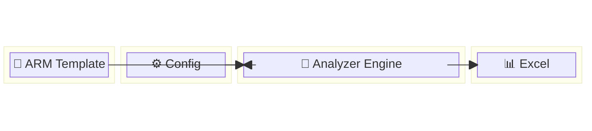

<br>

### 1.2 Complete System Flow Architecture

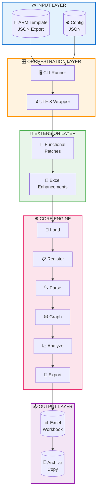

---

<br>

## 📊 SECTION 2: CORE ENGINE INTERNAL ARCHITECTURE

### 2.1 Eight-Phase Processing Pipeline

```mermaid
flowchart LR
    subgraph P1["Phase 1"]
        L["📂<br/>LOAD"]
    end
    
    subgraph P2["Phase 2"]
        R["📋<br/>REGISTER"]
    end
    
    subgraph P3["Phase 3"]
        PA["🔍<br/>PARSE"]
    end
    
    subgraph P4["Phase 4"]
        D["🔗<br/>DEPEND"]
    end
    
    subgraph P5["Phase 5"]
        G["🕸️<br/>GRAPH"]
    end
    
    subgraph P6["Phase 6"]
        T["📊<br/>TOPO"]
    end
    
    subgraph P7["Phase 7"]
        A["📈<br/>STATS"]
    end
    
    subgraph P8["Phase 8"]
        E["💾<br/>EXPORT"]
    end

    P1 --> P2 --> P3 --> P4 --> P5 --> P6 --> P7 --> P8

    style P1 fill:#BBDEFB,stroke:#1976D2,stroke-width:3px
    style P2 fill:#B3E5FC,stroke:#0288D1,stroke-width:3px
    style P3 fill:#B2EBF2,stroke:#0097A7,stroke-width:3px
    style P4 fill:#B2DFDB,stroke:#00796B,stroke-width:3px
    style P5 fill:#C8E6C9,stroke:#388E3C,stroke-width:3px
    style P6 fill:#DCEDC8,stroke:#689F38,stroke-width:3px
    style P7 fill:#FFF9C4,stroke:#FBC02D,stroke-width:3px
    style P8 fill:#FFCCBC,stroke:#E64A19,stroke-width:3px
```

<br>

### 2.2 Resource Parsing Order Hierarchy

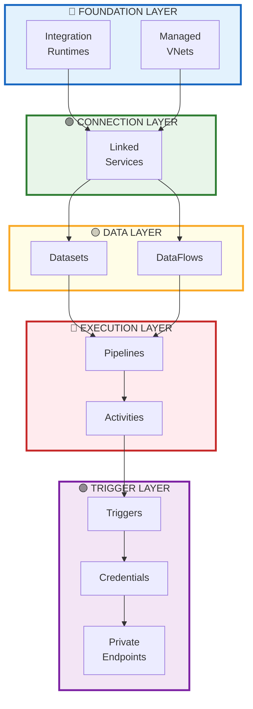

<br>

### 2.3 Data Structure State Machine

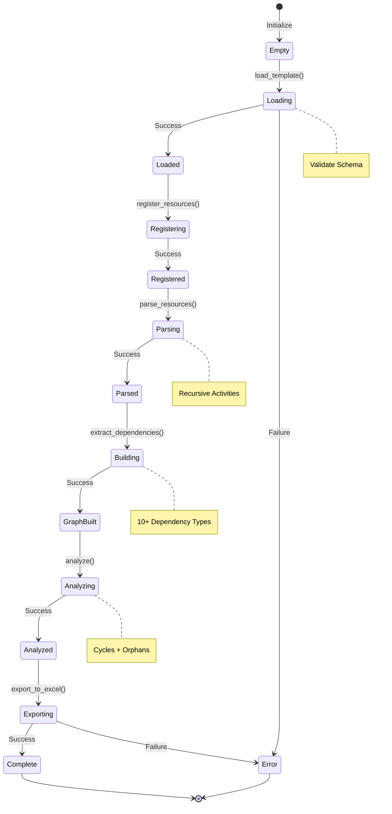

---

<br>

## 📊 SECTION 3: DEPENDENCY GRAPH ARCHITECTURE

### 3.1 Ten Dependency Types Visualization

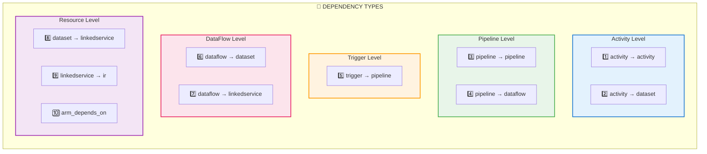

<br>

### 3.2 Full Resource Dependency Network

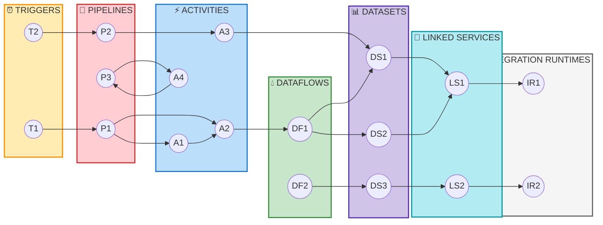

---

<br>

## 📊 SECTION 4: TOPOLOGICAL EXECUTION ORDERING

### 4.1 BFS Algorithm Flow

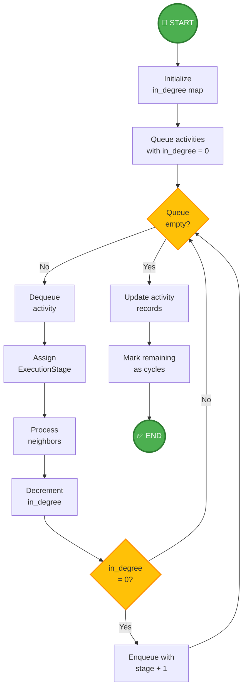

<br>

### 4.2 Execution Stage Levels Visualization

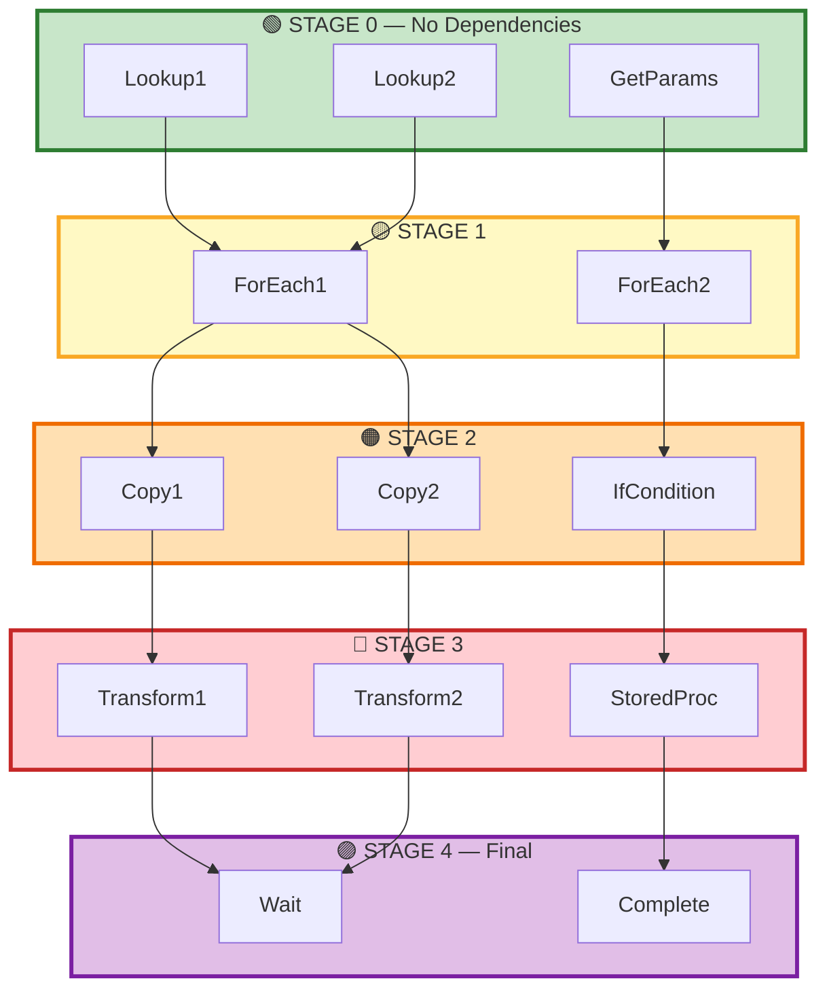

---

<br>

## 📊 SECTION 5: RECURSIVE ACTIVITY PARSING

### 5.1 Nested Container Structure

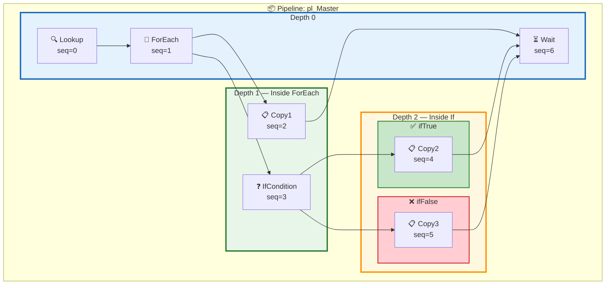

<br>

### 5.2 Container Type Dispatch

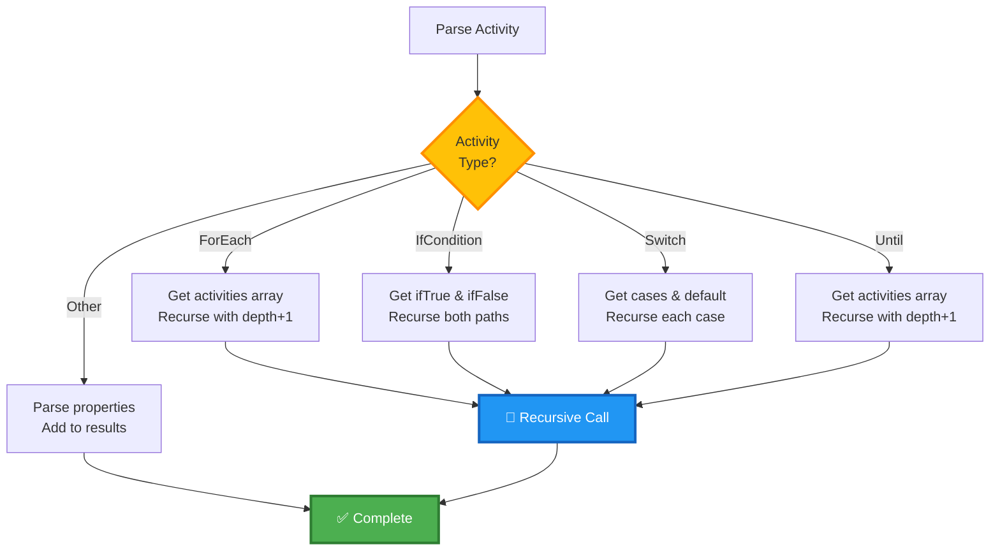

---

<br>

## 📊 SECTION 6: MONKEY PATCHING ARCHITECTURE

### 6.1 Patch Injection Sequence

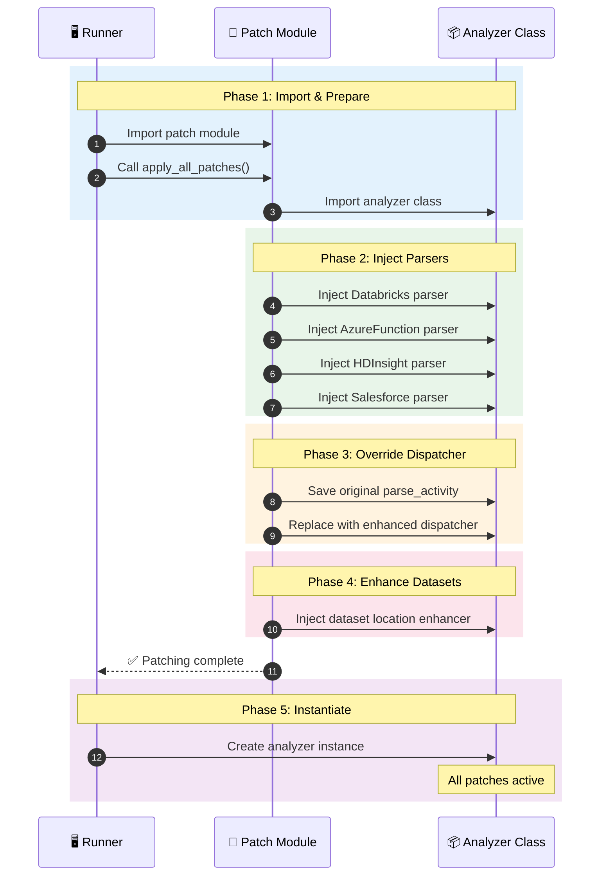

<br>

### 6.2 Before vs After Patching

```mermaid
flowchart LR
    subgraph BEFORE["🔵 BEFORE PATCHING"]
        direction TB
        B1["Base Class"]
        B2["19 Parsers"]
        B3["Original Dispatcher"]
    end

    subgraph PATCH["🟢 PATCH PROCESS"]
        direction TB
        P1["+ Databricks"]
        P2["+ AzureFunction"]
        P3["+ HDInsight"]
        P4["+ Salesforce"]
        P5["+ Dataset Enhance"]
        P6["Override Dispatcher"]
    end

    subgraph AFTER["🟣 AFTER PATCHING"]
        direction TB
        A1["Enhanced Class"]
        A2["26 Parsers"]
        A3["Enhanced Dispatcher"]
    end

    BEFORE --> PATCH
    PATCH --> AFTER

    style BEFORE fill:#BBDEFB,stroke:#1565C0,stroke-width:3px
    style PATCH fill:#C8E6C9,stroke:#2E7D32,stroke-width:3px
    style AFTER fill:#E1BEE7,stroke:#7B1FA2,stroke-width:3px
```

<br>

### 6.3 Enhanced Dispatcher Logic

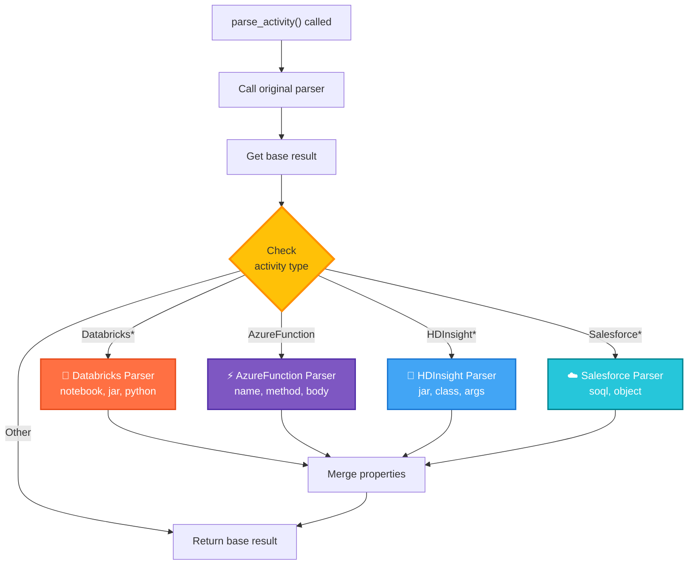

---

<br>

## 📊 SECTION 7: EXCEL EXPORT PIPELINE

### 7.1 Export Process Flow

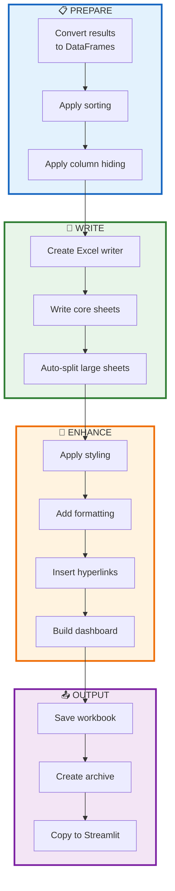

<br>

### 7.2 Excel Sheet Organization

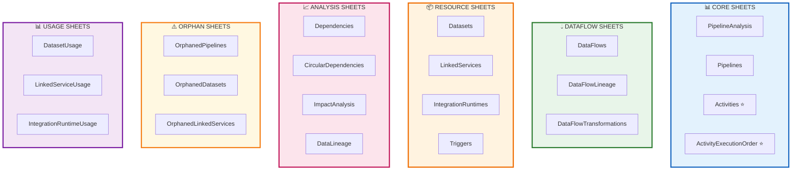

---

<br>

## 📊 SECTION 8: CLI EXECUTION MODES

### 8.1 Four Execution Mode Comparison

<table>
<tr>
<th>🔵 BASIC MODE<br/><code>--basic</code></th>
<th>🟢 FUNCTIONAL ONLY<br/><code>--skip-excel-enhancements</code></th>
<th>🟡 EXCEL ONLY<br/><code>--skip-functional</code></th>
<th>🟣 FULL PRODUCTION<br/>(default)</th>
</tr>
<tr>
<td>

- Skip functional patches
- Skip Excel enhancements
- Base analyzer only
- Plain Excel output

</td>
<td>

- Apply functional patches
- Skip Excel enhancements
- Extended parsers active
- Plain Excel output

</td>
<td>

- Skip functional patches
- Apply Excel enhancements
- Base parsers only
- Styled Excel output

</td>
<td>

- Apply functional patches
- Apply Excel enhancements
- All parsers active
- Fully enhanced Excel

</td>
</tr>
</table>

---

<br>

## 📊 SECTION 9: COMPLETE SYSTEM SUMMARY

### 9.1 System Architecture Overview

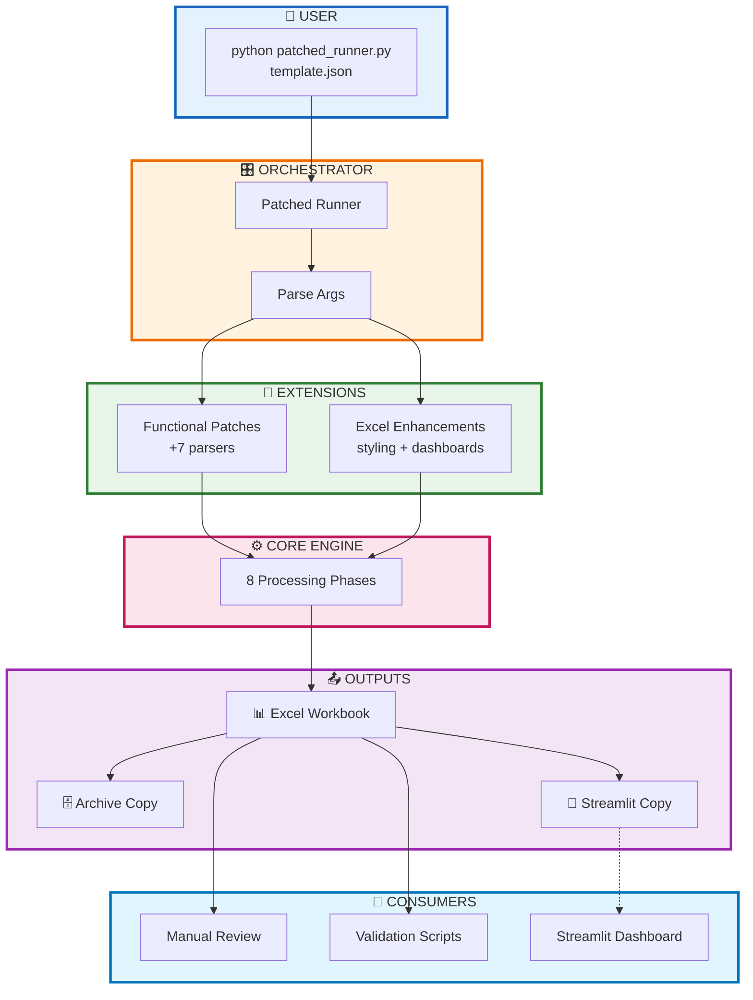

<br>

### 9.2 File Responsibility Summary

| File | Role | Key Functions |
|:-----|:----:|:--------------|
| `adf_analyzer_v10_complete.py` | ⚙️ Core Engine | ARM parsing, Dependency graphs, Topological sort, Excel export |
| `adf_analyzer_v10_patch.py` | 🧩 Extensions | Activity parsers, Dataset parsers, Dispatcher override |
| `adf_analyzer_v10_patched_runner.py` | 🎛️ Orchestrator | CLI handling, Patch control, Execution flow |
| `adf_analyzer_v10_excel_enhancements.py` | 🎨 Beautification | Styling, Formatting, Dashboards |

---

<br>

## 📋 DIAGRAM TYPE REFERENCE

| Section | Diagram Type | Purpose |
|:-------:|:-------------|:--------|
| 1.1 | Block Diagram | High-level system view |
| 1.2 | Layered Flowchart | Component architecture |
| 2.1 | Horizontal Pipeline | Phase progression |
| 2.2 | Vertical Hierarchy | Resource dependencies |
| 2.3 | State Diagram | Processing states |
| 3.1-3.2 | Network Graph | Dependency visualization |
| 4.1 | Algorithm Flowchart | BFS logic |
| 4.2 | Staged Flowchart | Execution levels |
| 5.1-5.2 | Nested Flowchart | Recursive structure |
| 6.1 | Sequence Diagram | Runtime interaction |
| 6.2-6.3 | Transformation Flowchart | Patch mechanism |
| 7.1-7.2 | Pipeline Flowchart | Export process |
| 8.1 | Comparison Table | Mode differences |
| 9.1-9.2 | Summary Flowchart | System overview |

---

<br>

## 📚 DOCUMENTATION ACCESS

### 📁 In-Dashboard Access

```
Dashboard → 📚 Documentation Tab → Choose Section
├── 📋 Dashboard Tiles
├── 🧠 Technical Logic  
├── 🐍 Python Files
├── 📖 Complete Guide
└── ⚙️ Configuration
```

### 📂 File System Access

```bash
# View documentation files
ls docs/
cat TILES.md
cat LOGIC.md
cat PYTHON_FILES_REFERENCE.md
```

---

<div align="center">

<br>

## 🚀 Ready to Analyze!

**Analyze your Azure Data Factory with unprecedented detail and professional reporting!**

<br>

---

**Document Version:** 3.0 Advanced Edition  
**Diagram Syntax:** Validated Mermaid 10.x  
**Last Updated:** January 20, 2025

<br>

[](mailto:masteravinashrai@gmail.com)
[](https://www.linkedin.com/in/avinashanalytics/)

<br>

**⭐ Star this repository if you find it helpful!**

</div>


